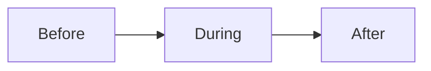

# Session guide checklist

Run this list before, during, and after a teach or coach session.

The session has three parts.

## Before you start
- [ ] Know the session goal.
- [ ] Review the [client scorecard](client-scorecard.md).
- [ ] Open the module and the task.
- [ ] Send the join link and the time.
- [ ] Test your sound and camera.

## Steps
- [ ] Start on time.
- [ ] Say the goal for the session.
- [ ] Teach the one idea for the day.
- [ ] Show one example.
- [ ] Ask the client to do the task.
- [ ] Watch and give feedback.
- [ ] Answer questions.
- [ ] Say the next step and the next date.
- [ ] End on time.
- [ ] Write short notes after the call.
- [ ] Send the recording and the task.

## Done when
- [ ] The client did the task in the session.
- [ ] The client knows the next step.
- [ ] Notes are saved on the scorecard.
- [ ] The recording and task are sent.
