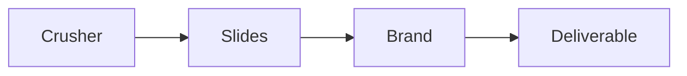

# Slide template checklist

Run this list to build the slides for one module.

One template repeats across every step.

## Before you start
- [ ] Finish the content crusher for the step.
- [ ] Get the brand colors and fonts.
- [ ] Read the delivery playbook.

## Steps
- [ ] Open the slide template.
- [ ] Add the title and the promise.
- [ ] Add one emotional image per slide.
- [ ] Keep text short. No long bullet lists.
- [ ] Add the three how-to actions.
- [ ] Add the example or proof.
- [ ] Add the deliverable for the step.
- [ ] Add the action slide.
- [ ] Apply the brand colors and fonts.
- [ ] Give credit for any borrowed image.
- [ ] Check the slides match the script.
- [ ] Export the deck.

## Done when
- [ ] The deck follows the template.
- [ ] Every slide has one clear idea.
- [ ] The brand is consistent.
- [ ] The deck matches the script.
