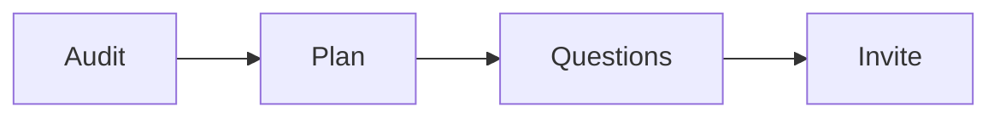

# Strategy session call checklist

Run this list to run one paid roadmap session.

The plan is the pitch.

## Before you start
- [ ] Get the [product roadmap](product-roadmap.md).
- [ ] Review the lead's application.
- [ ] Get the session price and the fee credit rule.

## Steps
- [ ] Confirm the session and the fee.
- [ ] Review the lead against the roadmap before the call.
- [ ] Open the call: time, purpose, and outcome.
- [ ] Audit each roadmap step. Ask for exact numbers.
- [ ] Mark what the lead has and what is missing.
- [ ] Build the 90-day plan with the lead.
- [ ] Ask: are you 100% confident this plan can work?
- [ ] Ask: could you do this alone?
- [ ] Ask: do you want my help to do it faster?
- [ ] Invite the lead to the program.
- [ ] Apply the fee to month one.
- [ ] If it is a no, end well and give the plan.

## Done when
- [ ] The lead leaves with a plan either way.
- [ ] The three questions are asked in order.
- [ ] The fee credit is offered.
- [ ] The call ends with a clear next step.
