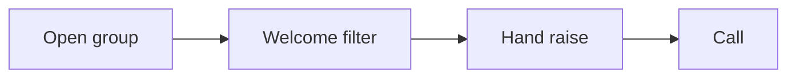

# Super group setup checklist

Run this list to open and run a controlled group.

The welcome filter finds the people who want help.

## Before you start
- [ ] Finish the lead magnet and the authority video.
- [ ] Get the one currency and message.
- [ ] Read the [super group playbook](../playbooks/super-group.md).

## Steps
- [ ] Name the group for the person and the result.
- [ ] Write a clear description with one action.
- [ ] Write the welcome post.
- [ ] Add the filter question: "Do you want to learn more?"
- [ ] Tag the members who raise their hand.
- [ ] Plan a simple post calendar.
- [ ] Post two-step posts, lives, and case studies.
- [ ] Keep every post inside the offer.
- [ ] Reply to hand-raisers the same day.
- [ ] Invite warm members to a call.
- [ ] Nurture the rest for about 90 days.
- [ ] Track who is ready.

## Done when
- [ ] The group has a clear welcome and filter.
- [ ] Hand-raisers get a same-day reply.
- [ ] Every post fits the offer.
- [ ] Calls are booked from the group.
