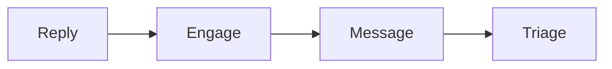

# Two-step outreach checklist

Run this list to book calls with warm contacts.

Keep it short, warm, and polite.

## Before you start
- [ ] Build the group or the lead list.
- [ ] Get the one currency and message.
- [ ] Read the [outreach playbook](../playbooks/outreach.md).

## Steps
- [ ] Start with warm contacts only.
- [ ] Reply to a post or comment first.
- [ ] Engage for a day or two.
- [ ] Send the first short, helpful message.
- [ ] Send a soft bump if there is no reply.
- [ ] Send one polite close. Then stop.
- [ ] Book a short triage call on interest.
- [ ] Check fit on the triage call.
- [ ] Book the main call for fits.
- [ ] Keep a simple pipeline: new, warm, booked, closed.
- [ ] Keep a healthy pace.

## Done when
- [ ] Every message goes to a warm contact.
- [ ] The sequence stops after the polite close.
- [ ] Triages lead to main calls.
- [ ] The pipeline is up to date.
