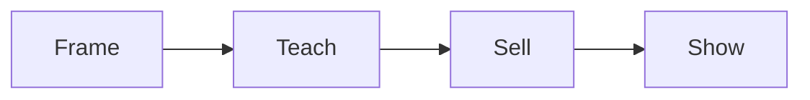

# Webinar run of show checklist

Run this list to plan and run one webinar.

The clock keeps the webinar on track.

## Before you start
- [ ] Get the one currency and message.
- [ ] Get the signature solution.
- [ ] Finish the slides and the pages.

## Steps
- [ ] Write the title for the person and the result.
- [ ] Set the frame: promise, who it is for, who it is not for.
- [ ] Write three teach blocks, one per phase.
- [ ] Teach the what, not the how.
- [ ] Write the shift: two options and a request to show the offer.
- [ ] Write the sell: tour, value stack, price, guarantee.
- [ ] Write the show: welcome new clients, answer doubts as questions.
- [ ] Build the pages: sign up, train, webinar, replay, order.
- [ ] Send the invite and reminder emails.
- [ ] Run the webinar live.
- [ ] Send the replay to everyone.
- [ ] Run the closing sequence for 3 to 5 days.

## Done when
- [ ] The webinar fits about 60 minutes.
- [ ] The offer is made once and clearly.
- [ ] The replay goes to all leads.
- [ ] The closing sequence is running.
