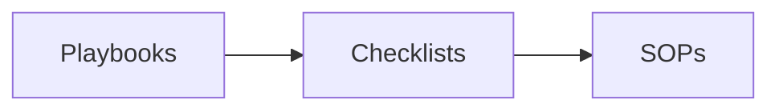
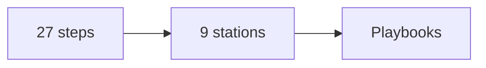
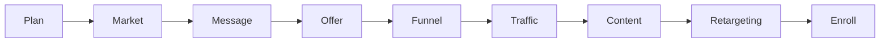
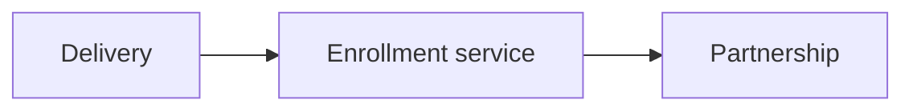
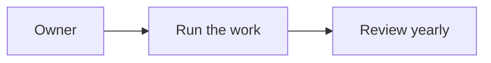

# RED Method Enterprise Operations Manual

This is the operations manual for the RED Method. It holds the playbooks,
checklists, and SOPs our team uses to run the method for a client. It is the
enterprise-grade manual for the RED Method.

## How to use this manual

- A **playbook** explains a station or a service line. It gives the goal, the
  steps, the gate, and the metrics.
- A **checklist** is a one-page tick list for recurring work.
- An **SOP** is a precise procedure for one repeatable task.

Start with the playbook for the work in front of you. Use its checklist to run
the work. Use its SOP when you need the exact steps.

## How this fits the method

The public method has three phases, nine motions, and 27 steps. See [the method
map](../method/motions.md). This manual runs the same work as nine stations.
Each station maps to one or more steps. The station is the unit we run. The step
is the unit we describe.

## The build line

The build line is the 12-week program. It has nine stations. Each station has
one playbook.

| Station | Playbook | Main output |
|---|---|---|
| Plan | [Plan playbook](playbooks/plan.md) | One-page plan |
| Numbers | [Numbers playbook](playbooks/numbers.md) | A numbers sheet |
| Market | [Market playbook](playbooks/market.md) | Avatar snapshot |
| Message | [Message playbook](playbooks/message.md) | One currency and message |
| Offer | [Offer playbook](playbooks/offer.md) | Profit pyramid and price |
| Funnel | [Funnel playbook](playbooks/funnel.md) | Live funnel and video |
| Traffic | [Traffic playbook](playbooks/traffic.md) | Live campaign |
| Content | [Content playbook](playbooks/content.md) | Content roadmap |
| Retargeting | [Retargeting playbook](playbooks/retargeting.md) | Retargeting plan |
| Enroll | [Enroll playbook](playbooks/enroll.md) | Enrollment script |

## The asset playbooks

These playbooks build one asset at a time. They run alongside the stations.

| Asset | Playbook | Main output |
|---|---|---|
| Lead magnet | [Lead magnet playbook](playbooks/lead-magnet.md) | One-page cheat sheet |
| Authority video | [Authority video playbook](playbooks/authority-video.md) | Finished video |
| Webinar | [Webinar playbook](playbooks/webinar.md) | Run of show and slides |
| Email and nurture | [Email and nurture playbook](playbooks/email-nurture.md) | A nurture sequence |
| Super group | [Super group playbook](playbooks/super-group.md) | A live group |
| Outreach | [Outreach playbook](playbooks/outreach.md) | Booked calls |
| Strategy session | [Strategy session playbook](playbooks/strategy-session.md) | A paid roadmap session |

## The service lines

The service lines run alongside the build line. They cover delivery, the
done-for-you enrollment asset, and the long-term partnership.

| Service line | Playbook | Main output |
|---|---|---|
| Delivery | [Delivery playbook](playbooks/delivery.md) | Client results and case study |
| Enrollment service | [Enrollment service playbook](playbooks/enrollment-service.md) | Enrollment asset |
| Partnership | [Partnership playbook](playbooks/partnership.md) | Renewal and referrals |
| Certification | [Certification playbook](playbooks/certification.md) | A certified team |

## Checklists

| Checklist | Use it for |
|---|---|
| [Kickoff](checklists/kickoff.md) | Start a client well |
| [Module production](checklists/module-production.md) | Build one module |
| [Session guide](checklists/session-guide.md) | Run a teach or coach session |
| [Client scorecard](checklists/client-scorecard.md) | Track one client |
| [Case study](checklists/case-study.md) | Capture a result |
| [Currency calculator](checklists/currency-calculator.md) | Pick the one currency |
| [Avatar ecosystem](checklists/avatar-ecosystem.md) | Build the avatar snapshot |
| [Product roadmap](checklists/product-roadmap.md) | Shape three stages and nine steps |
| [Content crusher](checklists/content-crusher.md) | Capture one step on one sheet |
| [Slide template](checklists/slide-template.md) | Build one module deck |
| [Recording and editing](checklists/recording-editing.md) | Record and edit fast |
| [Pricing](checklists/pricing.md) | Set and defend the price |
| [Funnel math](checklists/funnel-math.md) | Work out the numbers |
| [Booking page](checklists/booking-page.md) | Build the booking page |
| [Lead magnet PDF](checklists/lead-magnet-pdf.md) | Build the short PDF |
| [Ad fix](checklists/ad-fix.md) | Fix a weak campaign |
| [Hooks and headlines](checklists/hooks-headlines.md) | Make many hooks |
| [Webinar run of show](checklists/webinar-run-of-show.md) | Plan and run a webinar |
| [Email sequence](checklists/email-sequence.md) | Build a nurture sequence |
| [Super group setup](checklists/super-group-setup.md) | Open and run a group |
| [Two-step outreach](checklists/two-step-outreach.md) | Book calls with warm leads |
| [Strategy session call](checklists/strategy-session-call.md) | Run a paid session |
| [Launch calendar](checklists/launch-calendar.md) | Plan a 14-day launch |
| [Enrollment script](checklists/enrollment-script.md) | Build the sales script |
| [Checkpoint card](checklists/checkpoint-card.md) | Run the call gates |
| [Objection sheet](checklists/objection-sheet.md) | Answer common doubts |
| [Role-play drill](checklists/role-play-drill.md) | Practice the call |
| [Renewal and win-back](checklists/renewal-winback.md) | Keep a client |
| [Referral and partner](checklists/referral-partner.md) | Ask for referrals |
| [Community rules](checklists/community-rules.md) | Run the community |
| [Reputation track](checklists/reputation-track.md) | Collect reviews and press |

## SOPs

| SOP | Use it for |
|---|---|
| [Client onboarding](sops/client-onboarding.md) | Onboard a new client |
| [Module delivery](sops/module-delivery.md) | Deliver one module |
| [Session coaching](sops/session-coaching.md) | Coach on a call |
| [Case study capture](sops/case-study-capture.md) | Turn a result into a story |
| [Brain dump to roadmap](sops/brain-dump-to-roadmap.md) | Shape the product roadmap |
| [Million dollar message](sops/million-dollar-message.md) | Write the one message |
| [Lead magnet build](sops/lead-magnet-build.md) | Build a lead magnet |
| [Authority video build](sops/authority-video-build.md) | Build the authority video |
| [Content crusher build](sops/content-crusher-build.md) | Fill a content crusher |
| [Slide deck build](sops/slide-deck-build.md) | Build a module deck |
| [Course production](sops/course-production.md) | Record and publish modules |
| [Funnel build](sops/funnel-build.md) | Build the short funnel |
| [Ad campaign setup](sops/ad-campaign-setup.md) | Set up an ad campaign |
| [Retargeting setup](sops/retargeting-setup.md) | Set up retargeting |
| [Webinar build](sops/webinar-build.md) | Build and run a webinar |
| [Email sequence build](sops/email-sequence-build.md) | Build a nurture sequence |
| [Community launch](sops/community-launch.md) | Open and run a group |
| [Outreach sequence](sops/outreach-sequence.md) | Book calls with warm leads |
| [Strategy session run](sops/strategy-session-run.md) | Run a paid session |
| [Call audit](sops/call-audit.md) | Review a recorded call |
| [Pricing review](sops/pricing-review.md) | Review the price |
| [Certification exam](sops/certification-exam.md) | Certify an operator |
| [Enrollment asset build](sops/enrollment-asset-build.md) | Build the sales asset |
| [Role-play practice](sops/role-play-practice.md) | Drill the team |
| [Renewal](sops/renewal.md) | Renew a client |
| [Referral](sops/referral.md) | Run the referral loop |
| [Community moderation](sops/community-moderation.md) | Keep the community safe |
| [Reputation](sops/reputation.md) | Grow reviews and press |
| [Quarterly review](sops/quarterly-review.md) | Review the plan every 90 days |

## Owners and cadence

Every playbook has one owner. Every checklist is run by the person doing the
work. Every SOP is reviewed once a year.

## Rules

- No original brand name. Call the method the **RED Method**.
- Plain words. Short sentences. 3rd to 5th grade reading level.
- Add a small Mermaid diagram to each new idea in a `.md` file.

## Where to go next

- [The method map](../method/motions.md): three phases, nine motions, 27 steps.
- [The big idea](../method/big-idea.md): the five pillars and one currency.
- [Glossary](../glossary.md): plain words for the terms we use.
