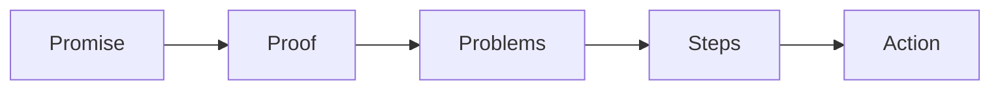
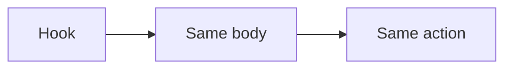

# Authority video playbook

This playbook builds the authority video: the short video that shows the offer.

## Goal

Build one short video that shows the signature solution and builds trust. Good
looks like a video that runs 8 to 20 minutes and follows one clear script. The
same script also runs ads, emails, and sales letters.

## When to use

Use this playbook in the Funnel station. Build the video before the traffic. It
is the first thing a cold lead sees.

## Roles

- Delivery lead: owns the script.
- Producer: records and edits.
- Coach: checks the script against the offer.
- Client: records the video.

## Inputs

- The signature solution.
- The one currency and message.
- Brand assets and slides.

## Key ideas

- **The 6 blocks.** Promise, proof, problems, steps, context, and action. One
  script runs every asset.
- **Block shuffling.** Change the order of the blocks to make new hooks. One
  body, many openings.
- **The 10-pack.** One flagship video and nine step videos. Each step gets its
  own short video.

## Steps

1. Write the promise block. Name the person, the result, and the time.
2. Write the proof block. Give your best results first.
3. Write the problems block. Name the three main obstacles.
4. Write the steps block. Show the path in three phases and nine steps.
5. Write the context block. Say who you are and why you.
6. Write the action block. One clear next step.
7. Check the script is right before you make slides.
8. Build slides from the script.
9. Record the video.
10. Edit the video and add captions.
11. Cut the same script into nine short step videos.

Here is the shape of every asset.

## One body, many hooks

Keep one main script. Swap the first block to make new ads and emails.

## Gate

The script follows the six blocks. It shows the signature solution. It has one
clear action. The script is checked before the slides are made.

## Metrics

- Watch time.
- Opt-in rate.
- Leads that book a call.

## Outputs

- A finished authority video.
- A nine-video step pack.

## Common failures

- Slides before the script. Fix: fix the script first.
- No proof. Fix: lead with your best result.
- More than one action. Fix: keep one clear next step.
- A video that is too long. Fix: keep it 8 to 20 minutes.

## Related

- Playbook: [Funnel playbook](funnel.md)
- Checklist: [Hook lines](../checklists/hooks-headlines.md)
- Checklist: [Slide template](../checklists/slide-template.md)
- Checklist: [Recording and editing](../checklists/recording-editing.md)
- SOP: [Authority video build](../sops/authority-video-build.md)
