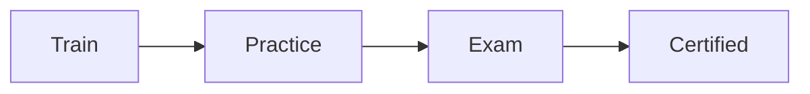
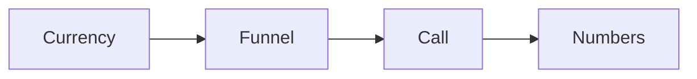

# Certification playbook

This playbook certifies a team so they can run the RED Method without us.

## Goal

Train and certify the client's team. Good looks like a team that can build the
machine, run the calls, and hold the standard. Certification proves they can.

## When to use

Use this playbook in the Serve and Partner stages. Offer it when the client's
team is ready to run the system.

## Roles

- Delivery lead: owns the standard and the exam.
- Coach: trains the team.
- Certified operator: runs the system day to day.
- Client: names the team.

## Inputs

- A working funnel and a working offer.
- The [playbooks](../index.md) and the [roadmap](../checklists/product-roadmap.md).
- At least one real result to use as proof.

## Key ideas

- **The standard.** A short list of skills and habits every operator must hold.
- **The exam.** A live or written check. A pass mark is required.
- **The proof rule.** Certify only after a real result. No result, no badge.

## Steps

1. Name the skills an operator must hold.
2. Train the team on the [playbooks](../index.md) and the [roadmap](../checklists/product-roadmap.md).
3. Have each person run real work with a coach watching.
4. Set the exam. A clear pass mark.
5. Test each person against the standard.
6. Certify the people who pass.
7. Keep a register of certified people.
8. Recheck the standard every year.

Here is the path from training to a certified team.

## The standard

Keep it short. An operator needs a few clear skills, not a long list.

- Can explain the one currency and message.
- Can build the funnel and the pages.
- Can run the enrollment call with the checkpoints.
- Can read the numbers and fix the weak step.

## Gate

The team runs the system on real work. Each certified person passes the exam.
No one is certified without a real result.

## Metrics

- People trained.
- Exam pass rate.
- Calls run by the team.
- Results held by the team.

## Outputs

- A certified team.
- A register of certified people.
- A standard to recheck each year.

## Common failures

- Certifying with no result. Fix: require one real result first.
- A long standard. Fix: keep it to a few clear skills.
- No recheck. Fix: review the standard every year.

## Related

- Playbook: [Delivery playbook](delivery.md)
- Playbook: [Partnership playbook](partnership.md)
- Playbook: [Enroll playbook](enroll.md)
- SOP: [Certification exam](../sops/certification-exam.md)
