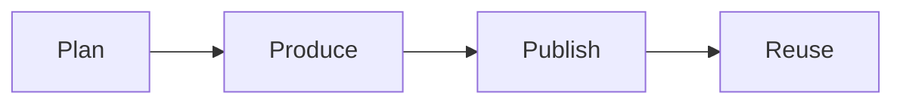

# Content playbook

This playbook builds an audience with content that lives inside the signature solution.

## Goal

Build a content engine that grows the audience. Every piece of content must live
inside the signature solution. The content teaches the one currency. It moves
people toward the offer.

## When to use

Use this playbook at Station 6, after the funnel and traffic are live. Use it on
the run line too. Content runs all the time.

## Roles

- Delivery lead: owns the roadmap and the results.
- Content producer: makes the posts, emails, and videos.
- Coach: checks that each piece fits the offer.
- Client: approves the plan and shares the content.

## Inputs

- The approved one currency and message.
- The signature solution with three phases and nine steps.
- The live funnel and the authority video.
- The avatar snapshot and the goals grid.

## Steps

1. Pull the nine steps of the signature solution into one list.
2. Turn each step into a content theme.
3. Build a content roadmap for the next 90 days.
4. Plan each piece: format, channel, and date.
5. Produce one asset at a time.
6. Publish the asset on three channels.
7. Promote the asset with a small paid push.
8. Reuse the asset in new formats.
9. Build retargeting audiences from video views.
10. Review the numbers each week and repeat what works.

## Gate

Every piece of content lives inside the signature solution. If a piece does not
teach the offer, do not publish it.

## Metrics

- Views and reach.
- Site visits from content.
- Audience growth.
- Leads from content.
- Cost per lead from content.

## Outputs

- A content roadmap.
- A growing audience.
- A library of reusable assets.

## Common failures

- Making content outside the offer. Fix: check each piece against the nine steps.
- Chasing trends. Fix: stay on the one currency.
- Publishing once and stopping. Fix: reuse and promote every asset.
- No plan. Fix: build the roadmap first.

## Related

- Playbook: [Offer playbook](offer.md)
- Playbook: [Traffic playbook](traffic.md)
- Playbook: [Retargeting playbook](retargeting.md)
- No checklist or SOP exists for this station yet.

The content engine has four moves.

