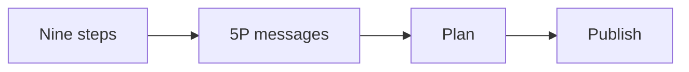
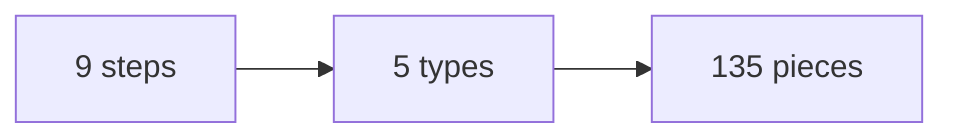
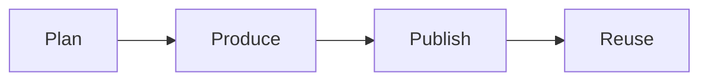

# Content playbook

This playbook builds an audience with content that lives inside the signature solution.

## Goal

Build a content engine that grows the audience. Every piece of content must live
inside the signature solution. The content teaches the one currency. It moves
people toward the offer.

## When to use

Use this playbook at Station 6, after the funnel and traffic are live. Use it on
the run line too. Content runs all the time.

## Roles

- Delivery lead: owns the roadmap and the results.
- Content producer: makes the posts, emails, and videos.
- Coach: checks that each piece fits the offer.
- Client: approves the plan and shares the content.

## Inputs

- The approved one currency and message.
- The signature solution with three phases and nine steps.
- The live funnel and the authority video.
- The avatar snapshot and the goals grid.

## Key ideas

- **The content crusher.** One sheet per step. The sheet holds the promise,
  the pain, the goal, the story, the steps, and the action.
- **The 5P message types.** Problem, Promise, Proof, Ping, and Promotion. Five
  ways to talk about any one step.
- **The conveyor belt.** One asset becomes many. Pull one thing from the
  roadmap and reuse it in every channel.
- **The hub and spoke.** Many small pieces feed one center. The center can be a
  group or a webinar.

## Steps

1. Pull the nine steps of the signature solution into one list.
2. Fill one content crusher per step.
3. Turn each step into a content theme.
4. Write five messages per step, one per 5P type.
5. Build a content roadmap for the next 90 days.
6. Plan each piece: format, channel, and date.
7. Produce one asset at a time.
8. Publish the asset on three channels.
9. Promote the asset with a small paid push.
10. Reuse the asset in new formats.
11. Build retargeting audiences from video views.
12. Review the numbers each week and repeat what works.

Here is how one step becomes a plan.

## The content math

Nine steps times five message types gives about forty-five themes. With formats
and channels, one roadmap can make more than a hundred pieces.

## Gate

Every piece of content lives inside the signature solution. If a piece does not
teach the offer, do not publish it.

## Metrics

- Views and reach.
- Site visits from content.
- Audience growth.
- Leads from content.
- Cost per lead from content.

## Outputs

- A content roadmap.
- A growing audience.
- A library of reusable assets.

## Common failures

- Making content outside the offer. Fix: check each piece against the nine steps.
- Chasing trends. Fix: stay on the one currency.
- Publishing once and stopping. Fix: reuse and promote every asset.
- No plan. Fix: build the roadmap first.
- Only one message type. Fix: rotate through the 5P types.

## Related

- Playbook: [Offer playbook](offer.md)
- Playbook: [Email and nurture playbook](email-nurture.md)
- Playbook: [Traffic playbook](traffic.md)
- Playbook: [Retargeting playbook](retargeting.md)
- Checklist: [Content crusher](../checklists/content-crusher.md)

The content engine has four moves.

