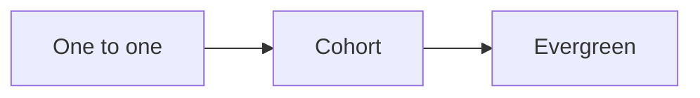
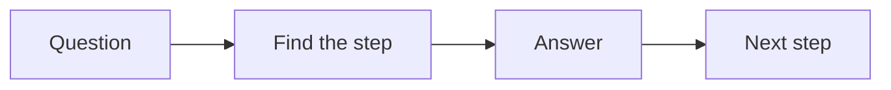
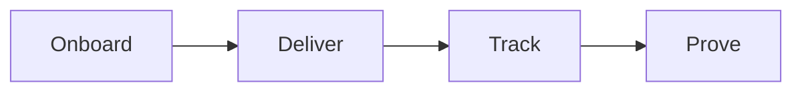

# Delivery playbook

This playbook delivers the RED program to the client and creates real results.
The client serves their own customers. We build the machine. They run it.

## Goal

Onboard the client well. Deliver one module per week for 6 to 12 weeks. Teach on
one day and coach on another. Track progress. Collect a case study when results
land.

## When to use

Use this playbook in the Serve stage, after the client buys. It runs for the
full program. It starts at kickoff and ends at the case study.

## Roles

- Delivery lead: owns the client relationship and the results.
- Coach: teaches and coaches the client.
- Producer: builds each module.
- Client: does the work and shares the numbers.

## Inputs

- A signed client and a start date.
- The signature solution and the product outline.
- The success goals from kickoff.
- The module production standard.

## Key ideas

- **The delivery ladder.** Start one to one. Move to a live cohort. Then record
  it as an evergreen program.
- **The roadmap audit.** Once every 90 days, check the client against their own
  roadmap. Find the missing step.
- **One deliverable per step.** Every module gives the client a working tool.
- **Marketing inception.** Every deliverable doubles as a marketing asset. The
  client gets a result and we get content.

## Steps

1. Onboard the client with a welcome and a kickoff.
2. Set success goals and a start date.
3. Build the module plan for 6 to 12 weeks.
4. Produce one module per week. Use the [content crusher](../checklists/content-crusher.md) and the [slide template](../checklists/slide-template.md).
5. Teach the module on one day.
6. Coach the client on another day.
7. Track attendance, progress, and results.
8. Review the [scorecard](../checklists/client-scorecard.md) each week.
9. Audit the client against the roadmap every 90 days.
10. Fix what is stuck.
11. Collect a case study the moment results land.
12. Turn each finished step into a small offer.

Here is the path from one to one to evergreen.

## Teach with the roadmap

The roadmap is the map. When the client asks a question, find where they are on
the map. Answer from that step. Do not jump around.

## Gate

Results are measured against the goals set at kickoff. If the results do not
match the goals, fix the plan before you close.

## Metrics

- Module completion.
- Attendance.
- Client results against goals.
- Client scorecard.
- Case studies collected.

## Outputs

- Client results.
- A case study.
- A reference.
- A set of small offers for the next stage.

## Common failures

- Weak kickoff. Fix: use the [kickoff checklist](../checklists/kickoff.md).
- No goals. Fix: set them at kickoff.
- Skipping the scorecard. Fix: review it each week.
- Waiting to collect proof. Fix: capture the case study when results land.
- Modules give words only. Fix: add one deliverable per step.

## Related

- Checklist: [Kickoff](../checklists/kickoff.md)
- Checklist: [Module production](../checklists/module-production.md)
- Checklist: [Session guide](../checklists/session-guide.md)
- Checklist: [Client scorecard](../checklists/client-scorecard.md)
- Checklist: [Case study](../checklists/case-study.md)
- Checklist: [Content crusher](../checklists/content-crusher.md)
- Checklist: [Slide template](../checklists/slide-template.md)
- SOP: [Client onboarding](../sops/client-onboarding.md)
- SOP: [Module delivery](../sops/module-delivery.md)
- SOP: [Session coaching](../sops/session-coaching.md)
- SOP: [Course production](../sops/course-production.md)
- SOP: [Case study capture](../sops/case-study-capture.md)

Delivery has four moves.

