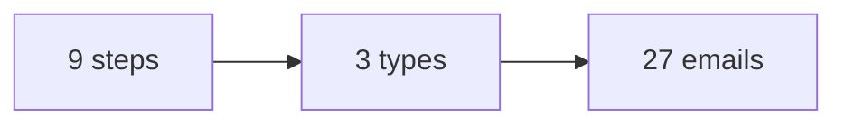
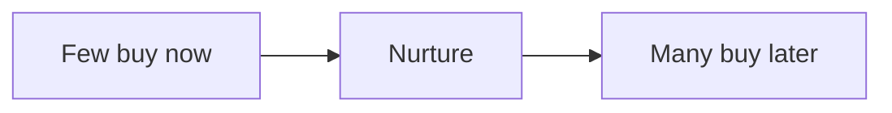

# Email and nurture playbook

This playbook keeps the audience warm over time with email and a nurture
sequence.

## Goal

Build one nurture sequence that runs on its own. Good looks like a set of
emails that go out in order and move a lead one step at a time. Most leads buy
later, not now, so follow-up matters.

## When to use

Use this playbook on the run line, after the funnel works. Create one sequence
per funnel step, and repeat until the lead takes the action.

## Roles

- Delivery lead: owns the list and the sequence.
- Producer: writes the emails.
- Coach: checks the offer fit.
- Client: approves the emails.

## Inputs

- The signature solution and the roadmap.
- The one currency and message.
- The authority video.

## Named framework

- **The 5P types.** Problem, Promise, Proof, Ping, and Promotion. Five kinds of
  email.
- **The cap.** Keep promotion to about one in five emails. The rest give value.
- **The sequence-until-action rule.** Send the sequence for one step until the
  lead takes that step.
- **The hub and spoke.** Many small pieces of content feed one center, like a
  group or a webinar.

## Steps

1. Pull the nine steps of the signature solution.
2. For each step, plan a value email, a pain email, and an offer email.
3. Write the emails. Use the 5P types.
4. Build one sequence of 27 parts: three types times nine steps.
5. Add one clear action to every email.
6. Keep the promotion cap. About one in five.
7. Build one sequence for each funnel step.
8. Send the sequence until the lead acts.
9. Reuse your slides as emails.
10. Review open and click rates each week.

Here is how the sequence is built.

## Most leads buy later

Few leads are ready now. Many buy within a few months. The nurture is how we
stay in the room.

## A worked example

A health coach found that only a small share of leads were ready to buy at
once, and many bought within three to six months. The plan was simple: a paid
ad, a community, a short workshop, and a steady nurture. The workshop did not
have to be perfect. The follow-up did the work.

## Gate

Every email lives inside the signature solution. It has one clear action. The
promotion cap holds. One sequence runs for each funnel step.

## Metrics

- Open rate.
- Click rate.
- Leads that take the next step.
- Unsubscribe rate.

## Outputs

- A 27-part nurture sequence.
- One sequence per funnel step.

## Common failures

- All promotion. Fix: keep it to one in five.
- No action. Fix: add one clear next step to every email.
- One email only. Fix: run the sequence until the lead acts.
- Content outside the offer. Fix: pull from the nine steps.

## Related

- Checklist: [Email sequence](../checklists/email-sequence.md)
- Playbook: [Content playbook](content.md)
- Playbook: [Webinar playbook](webinar.md)
- Playbook: [Super group playbook](super-group.md)
- SOP: [Email sequence build](../sops/email-sequence-build.md)
