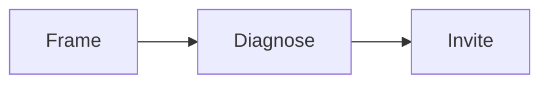
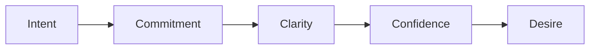
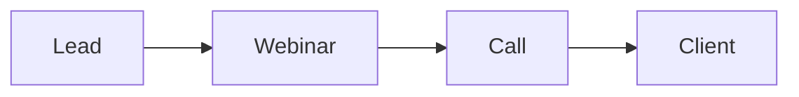

# Enroll playbook

This playbook turns a booked call into a paying client.

## Goal

Run a calm enrollment call. Frame the call. Diagnose the gap. Invite with no
pressure. Every gate passes before the invite. The call ends in a clear yes or a
clear no.

## When to use

Use this playbook at Station 8, after the funnel and traffic are live. Use it
for every booked call. Offer a paid strategy session for premium offers.

## Roles

- Enrollment specialist: runs the call.
- Delivery lead: owns the script and the checkpoints.
- Coach: reviews recorded calls.
- Client: approves the script.

## Inputs

- The approved one currency and message.
- The signature solution and the product roadmap.
- The enrollment script and the question set.
- The checkpoint list.

## Key ideas

- **The checkpoint system.** Five gates inside the call: intent, commitment,
  clarity, confidence, and desire. The lead must pass a gate before you move on.
- **The three C's.** Commitment, clarity, and confidence. The buyer needs all
  three to decide.
- **Objection prevention.** Clear the doubt before the end. If the gates are in
  order, the lead should not raise a new objection at the close.

## Steps

1. Prep before the call. Read the lead notes and the roadmap.
2. Frame the call: set the time, purpose, and outcome.
3. Check intent. End early if the lead is not a fit.
4. Audit the lead against the roadmap. Ask for exact numbers.
5. Do not solve or pitch yet.
6. Check commitment. Get a 5 before you prescribe.
7. Check clarity and confidence.
8. Check who decides and the timing.
9. Give a short plan.
10. Ask: if the plan and price work, are they ready to start?
11. Invite with no pressure.
12. Answer doubts with questions, not pressure.
13. Track why each call ends.
14. Offer a paid strategy call for premium offers.

The call has three phases.

### The checkpoints

A checkpoint is a quick gate inside the call. The lead must pass it before you
move on. If a gate fails, stop or step back. Do not push.

- **Intent.** Ask in the first minutes. If the lead is not ready, end well.
- **Commitment.** Ask for a score out of five. A low score means low intent.
- **Clarity.** Does the lead see the plan and the path?
- **Confidence.** Do they believe they can do it with help?
- **Desire.** Do they want the result enough to invest?

### The three enrollment models

Pick one model for the client.

- **One call.** An application gates the call. One strong conversation.
- **Two calls.** A short triage call first, then the main call.
- **A paid session.** The lead pays for a roadmap session. It qualifies and it
  earns revenue. See the [strategy session playbook](strategy-session.md).

## Gate

Every gate passes before the invite. A clear yes or a clear no is a win. An
early call with the wrong lead is a success.

## Metrics

- Show rate.
- Close rate.
- Call length.
- Gate pass rate.
- Reason each call ends.

## Outputs

- An enrollment script.
- A question set.
- A checkpoint list.

## Common failures

- Pitching too early. Fix: pass the intent gate first.
- Solving the problem on the call. Fix: diagnose, then prescribe.
- Pushing after a no. Fix: accept the no and end well.
- Skipping the checkpoints. Fix: use the checkpoint card.
- Quoting a price before agreement. Fix: get a yes to move forward first.

## Related

- Playbook: [Strategy session playbook](strategy-session.md)
- Checklist: [Enrollment script](../checklists/enrollment-script.md)
- Checklist: [Checkpoint card](../checklists/checkpoint-card.md)
- Checklist: [Objection sheet](../checklists/objection-sheet.md)
- Checklist: [Role-play drill](../checklists/role-play-drill.md)
- SOP: [Enrollment asset build](../sops/enrollment-asset-build.md)
- SOP: [Role-play practice](../sops/role-play-practice.md)
- SOP: [Call audit](../sops/call-audit.md)

## The webinar as a second enrollment mechanism

The call is the first enrollment mechanism. Once the funnel works, add a
webinar. The webinar teaches and sells at scale, then moves the lead to a call.
That is the scaled path: lead to webinar to call.

See [the enrollment evolution](../../method/enrollment-evolution.md) and the
[Webinar playbook](webinar.md).
