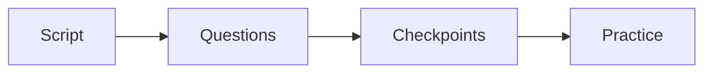

# Enrollment service playbook

This playbook builds a done-for-you enrollment asset for the client.

## Goal

Help the client enroll more customers without feeling pushy or fake. Write the
script from the client's one currency and roadmap. Build the question set. Set
the checkpoints. Write objection answers. Practice with role play. Review
recorded calls.

## When to use

Use this playbook in the Launch stage, as a white-glove add-on. Use it when the
client wants us to build and run the enrollment asset.

## Roles

- Enrollment specialist: builds and runs the asset.
- Delivery lead: owns the client relationship.
- Coach: runs the role play.
- Client and team: learn and run the script.

## Inputs

- The client's one currency and message.
- The product roadmap and the signature solution.
- The common objections from past calls.
- Recorded calls for review.

## Steps

1. Write the script from the one currency and roadmap.
2. Build the question set: current numbers, goal numbers, and gaps.
3. Set the checkpoints: intent, commitment, value, confidence, and desire.
4. Write answers to the common objections.
5. Practice with the client and their team using role play.
6. Review recorded calls and note where each call ended.
7. Fix the script and repeat.

## Gate

The script is clear. The gates are in order. The team can run it without
pressure.

## Metrics

- Script clarity score.
- Gate pass rate.
- Close rate.
- Objection win rate.
- Team confidence.

## Outputs

- A ready enrollment script.
- A question guide.
- A checkpoint card.

## Common failures

- A script that sounds fake. Fix: use the client's own words.
- Gates out of order. Fix: use the checkpoint card.
- No practice. Fix: run role play before the first live call.
- No review. Fix: review recorded calls each week.

## Related

- Checklist: [Enrollment script](../checklists/enrollment-script.md)
- Checklist: [Checkpoint card](../checklists/checkpoint-card.md)
- Checklist: [Objection sheet](../checklists/objection-sheet.md)
- Checklist: [Role-play drill](../checklists/role-play-drill.md)
- SOP: [Enrollment asset build](../sops/enrollment-asset-build.md)
- SOP: [Role-play practice](../sops/role-play-practice.md)

The asset build has four moves.

