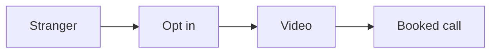
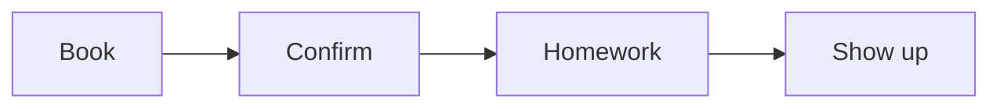
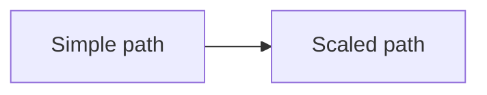

# Funnel playbook

This playbook builds the simple path that turns a stranger into a booked call.

## Goal

Build a simple path that turns a stranger into a booked call. Good looks like a
live funnel and a finished authority video. Keep the path short. Friction is the
enemy.

## When to use

Use this after the offer. It is Station 4.

## Roles

- Delivery lead: runs the build.
- Coach: checks the script and the pages.
- Client: records the video.

## Inputs

- The signature solution.
- The one message.
- Brand assets.

## Key ideas

- **The short funnel.** Ad, opt in, authority video, calendar, confirmation.
  Four to five steps. No more.
- **The authority video 6 blocks.** Promise, proof, problems, steps, context,
  and action. The same six blocks also run ads, emails, and sales letters.
- **The two-step opt in.** A second click raises quality. It filters out people
  who will not show up.
- **The 72-hour rule.** A booked call holds best within 72 hours. After that,
  the show rate drops about 10 to 20% a day.

## Steps

1. Write a short video that shows the signature solution.
2. Use the six blocks: promise, proof, problems, steps, context, action.
3. Check the script is right before you make slides.
4. Build four pages: opt in, video, calendar, and confirmation.
5. Add a second click before the video. This is the two-step opt in.
6. Add branding to the slides and pages. Keep one look.
7. Record the video. Keep it 8 to 20 minutes.
8. Edit the video and add captions.
9. Add a homework page before the call so people show up ready.
10. Confirm the call more than once. Add a reminder the day before.
11. Turn the funnel on.
12. Test one thing at a time, starting at the top of the funnel.

The funnel moves a stranger to a booked call.

## Hold the lead

- Book the call within 72 hours. Ideal is 24 to 48 hours.
- Send three or four confirmations.
- Give a short homework task. It moves the free line and filters the lead.
- Offer a small useful thing before the call.

## Model what works

Look at a proven funnel in the market. Map its pages and its traffic. Do not
copy it. Use it to see what already works, then make your own version.

## Gate

The script is right before the slides. The funnel captures, engages, and
converts. Pages follow a clean brand. The call is booked within 72 hours.

## Metrics

- Page conversion.
- Opt-in rate.
- Show rate.
- Cost per booked call.

## Outputs

- A live funnel.
- A finished authority video.
- A homework page.

## Common failures

- Slides come before the script. Fix: fix the script first.
- Pages look off brand. Fix: use the brand assets.
- The funnel leaks. Fix: check each page in order.
- A long gap before the call. Fix: book within 72 hours.

## The enrollment evolution

This playbook builds the simple path: a lead magnet to a call. Once it works,
add a webinar. That is the scaled path: lead to webinar to call.

See [the enrollment evolution](../../method/enrollment-evolution.md) and the
[Webinar playbook](webinar.md).

## Related

- Playbook: [Authority video playbook](authority-video.md)
- Playbook: [Lead magnet playbook](lead-magnet.md)
- Checklist: [Booking page](../checklists/booking-page.md)
- SOP: [Funnel build](../sops/funnel-build.md)
