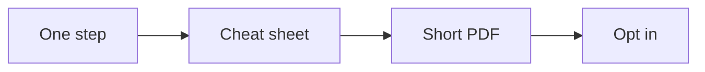

# Lead magnet playbook

This playbook turns one step of the offer into a small, useful lead magnet.

## Goal

Build one lead magnet that attracts the right person. Good looks like a one-page
cheat sheet and a short PDF that pair with the authority video. Do not build a
lead magnet from scratch.

## When to use

Use this playbook in the Funnel station, before the traffic. Build it from the
signature solution. One hot step.

## Roles

- Delivery lead: picks the step and owns the asset.
- Producer: builds the cheat sheet and the PDF.
- Coach: checks the asset grabs the right person.
- Client: approves the asset.

## Inputs

- The signature solution and the product roadmap.
- The one currency and message.
- The authority video.

## Named framework

- **The wheel of awesome.** Every step of the offer is already useful. Pull one
  step out and turn it into the lead magnet. Never invent a new one.
- **The one-page rule.** The magnet is one page. Fast to use. Ten minutes or
  less.
- **The open loop.** Name a problem and show part of the fix. Leave the next
  step for the call.

## Steps

1. Pick one hot step of the signature solution.
2. Name the magnet for the person and the result.
3. Write the one-page cheat sheet.
4. Wrap it in a short PDF: title, proof, a short bio, the problem, the steps,
   and one clear action.
5. Pair the magnet with the authority video.
6. Use one image, the picture of the thing itself.
7. Add a second click before the page. This is the two-step opt in.
8. Send the magnet by email, not on the thank-you page.
9. Test it and keep the winner.

Here is how a step becomes a lead magnet.

## Rules for a good magnet

- It solves one small problem.
- It is incomplete on purpose.
- It has one clear next step.
- It fits in about ten minutes.

## Gate

The magnet uses one step and the one currency. It pairs with the authority
video. It has one clear action. It is not an ebook, a long course, or a quiz.

## Metrics

- Opt-in rate.
- Cost per lead.
- Leads that watch the video.

## Outputs

- A one-page cheat sheet.
- A short PDF.
- One clear next step.

## Common failures

- Building it from scratch. Fix: use a step of the offer.
- It is too long. Fix: keep it to one page.
- It gives everything away. Fix: leave one step for the call.
- It is a quiz or an ebook. Fix: use a cheat sheet.

## Related

- Checklist: [Lead magnet PDF](../checklists/lead-magnet-pdf.md)
- Playbook: [Funnel playbook](funnel.md)
- Playbook: [Authority video playbook](authority-video.md)
- SOP: [Lead magnet build](../sops/lead-magnet-build.md)
