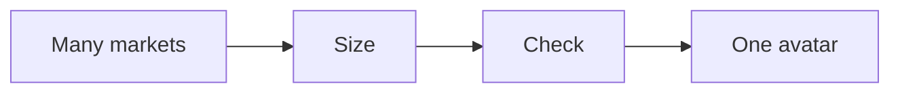
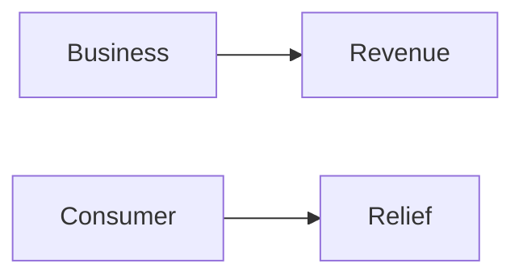

# Market playbook

This playbook finds the one market and the one avatar you can reach and serve.

## Goal

Find one market you can reach and serve. Good looks like a clear avatar
snapshot and a goals grid. The market work follows the one currency. We research
the problem, not just the person.

## When to use

Use this after the plan. It is Station 1.

## Roles

- Delivery lead: runs the research.
- Coach: checks the market fit.
- Client: shares what they know about the buyer.

## Inputs

- The one-page plan.
- Access to social and business networks.
- Notes on the buyer's pains, goals, and fears.

## Key ideas

- **The 360 avatar ecosystem.** One product can serve many avatars. We build
  one avatar per step of the offer, not one narrow niche. Tests pick the winner.
- **Research by currency.** We start from the problem people already pay to
  solve. We read book covers, reviews, courses, and search results. We do not
  guess.
- **The goals grid.** One chart of what the one person wants: goals, pains, and
  fears.

## Steps

1. Size the market on social networks.
2. Size the market on business networks.
3. List the top pains of the buyer.
4. List the top goals of the buyer.
5. List the top fears of the buyer.
6. Check the market has profit, presence, and a path to reach people.
7. Narrow many markets down to one.
8. Pick one avatar for the first step of the offer.
9. Fill in the avatar goals grid.
10. Ask the market one question: "If I could solve one problem for you in the
    next 90 days, which would it be?"

The market work narrows many people down to one.

## Two kinds of buyer

- **Business buyers.** Under about $50M in revenue, they buy revenue. They do
  not buy freedom, time off, or profit in the abstract.
- **Consumer buyers.** They buy relief from a pain more than a nice-to-have.
  Show them the end of the problem.

Here is how each kind of buyer thinks.

## Gate

The market is big enough. It is reachable. It has a problem worth solving. If
not, pick another market.

## Metrics

- Audience size.
- Reach.
- Problem size.
- Cost to reach one person.

## Outputs

- An avatar snapshot.
- A goals grid.
- One avatar for the first step.

## Common failures

- The market is too small. Fix: size it before you pick it.
- The market is hard to reach. Fix: check the path to people first.
- The avatar is everyone. Fix: pick one person who hangs out with the others.
- Picking by avatar, not by problem. Fix: start from the currency.

## Related

- Checklist: [Avatar ecosystem](../checklists/avatar-ecosystem.md)
- Playbook: [Message playbook](message.md)
- SOP: [Million dollar message](../sops/million-dollar-message.md)
