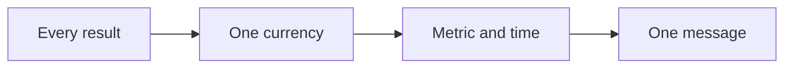

# Message playbook

This playbook turns a category into one currency and one clear message.

## Goal

Pick one currency and write one message. Good looks like one measured result
with a metric and a timeline. The message names the person, the result, and the
time, and the friction we remove.

## When to use

Use this after the market. It is Station 2. This is the hardest gate in the
line.

## Roles

- Delivery lead: runs the session.
- Coach: pushes for one clear result.
- Client: approves the message.

## Inputs

- The avatar snapshot.
- The goals grid.
- A list of every result the client could sell.

## Named framework

- **The currency calculator.** Two columns: what you increase and what you
  decrease. Fill it from client talk, books, courses, and search. Then pick one.
- **Hot and cold currencies.** Hot currencies are money, health, love, and
  business results. Cold words like growth, impact, and authority do not sell.
- **The message formula.** "I help [person] get [result] in [time] without
  [friction]."
- **The message filters.** Does it wake them at 3 a.m.? Is it a painkiller, not
  a vitamin? Is it in their own words?

## Steps

1. List every result you could sell. Use the two columns.
2. Pick the one result that is critical and specific.
3. Ask the market which problem they want solved first.
4. Give the result a metric.
5. Give the result a timeline. The length of the program can be the timeline.
6. Name the three main obstacles the buyer faces.
7. Write one message. Tie the person, the result, and the time together.
8. Run the message through the filters.
9. Get the message approved. Expect three or four passes.

One currency flows into the message.

## Keep the message as the master

The message is a master template. Do not use it word for word everywhere. Take
pieces of it for ads, emails, hooks, and the booking page. Every step of the
offer can have its own small message.

## Gate

One currency. One word if possible. The message has a metric and a timeline. It
is approved before you move on. Do not pass this gate without approval.

## Metrics

- Metric and timeline.
- Message clarity.
- Reply and click rate on tests.

## Outputs

- A currency calculator.
- One message.

## Common failures

- More than one currency. Fix: pick one and drop the rest.
- No metric or timeline. Fix: add a number and a date.
- A cold word like growth. Fix: name a measured result.
- The message is not approved. Fix: stop and get a clear yes.

## Related

- Checklist: [Currency calculator](../checklists/currency-calculator.md)
- Checklist: [Hooks and headlines](../checklists/hooks-headlines.md)
- SOP: [Million dollar message](../sops/million-dollar-message.md)
- Method: [The money message](../../method/money-message.md)
