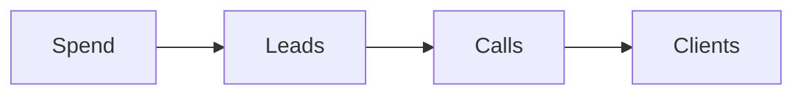

# Numbers playbook

This playbook shows how the numbers fit together across the whole method.

## Goal

Understand the few numbers that decide the business. Good looks like one page
of numbers that the team watches every week. The master number is the lifetime
value of a client.

## When to use

Use this playbook in the Plan station and again on the run line. Re-run it any
time a number changes.

## Roles

- Delivery lead: owns the numbers.
- Coach: checks the numbers against the plan.
- Client: gives the real numbers.

## Inputs

- The one currency and the offer price.
- The live ad campaign and funnel.
- The current close rate on calls.

## Named framework

- **The master number.** Lifetime value. If the value of a client goes up,
  everything else gets easier.
- **The 1% rule.** Plan for 1 lead in 100 to buy. If it works at 1%, it works
  at any higher rate.
- **The metrics chain.** Spend, leads, calls, and clients. Each step has one
  number.
- **The lead-value curve.** A lead is worth a little on day one and more over
  time. Follow-up is where the money is.

## Steps

1. Write the price of the offer.
2. Work out the value of one lead. Price divided by 100 is the planning figure.
3. Work out the cost per lead.
4. Work out the cost per booked call.
5. Work out the cost per client.
6. Work out the lifetime value of a client.
7. Compare the cost per client to the lifetime value.
8. Change one number. Watch the chain move.

The chain runs like this.

## Target numbers

Use these as targets, not promises. They are examples from the canon.

- Premium offer floor: $3,000 or more.
- Cost per lead: about $10 to start.
- Leads that book a call: 3 to 5%.
- Calls that enroll: 20 to 40%.
- Leads that buy: about 1%.
- Opt-in rate: 30% or more.
- Show rate: 70 to 80%.
- Webinar: 40% register, 40% show, 8% buy live.

## The rule of payback

You can pay more for a lead when the client is worth more. This is why we raise
lifetime value first.

## Gate

Every number is written down. The cost per client is lower than the lifetime
value. If not, stop and fix the offer or the funnel.

## Metrics

- Lifetime value.
- Cost per lead.
- Cost per client.
- Return on ad spend.

## Outputs

- A one-page numbers sheet.
- The one number to fix next.

## Common failures

- Fixing cost per lead only. Fix: raise the lifetime value.
- Using guesses. Fix: pull the real numbers.
- Watching too many numbers. Fix: pick one per step.

## Related

- Checklist: [Funnel math](../checklists/funnel-math.md)
- Playbook: [Plan playbook](plan.md)
- Playbook: [Traffic playbook](traffic.md)
- Playbook: [Webinar playbook](webinar.md)
- Method: [How the numbers work](../../method/numbers.md)
