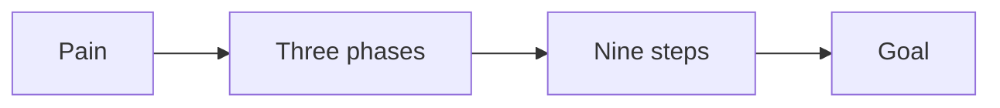
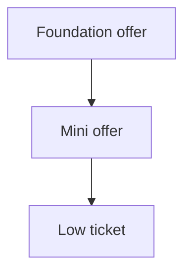

# Offer playbook

This playbook packages the work into a product with a price.

## Goal

Package the work into a product with a price. Good looks like a profit pyramid,
a signature solution, a product roadmap, and a price. The offer solves one
important problem in a crowded market.

## When to use

Use this after the message. It is Station 3. Get feedback before design.

## Roles

- Delivery lead: runs the design.
- Coach: checks the path and the price.
- Client: gives feedback before design.

## Inputs

- The one currency.
- The one message.
- The avatar snapshot.

## Key ideas

- **Offer DNA.** A strong offer is singular, sequential, productized, popular,
  competitive, and essential. One problem. One path. One price.
- **The rule of threes.** Three stages, nine steps, twenty-seven actions. This
  shape fits any subject.
- **One deliverable per step.** Every step gives the buyer a thing, not words.
  A checklist, template, or tool.
- **The bookend model.** The offer and the price decide success. Everything in
  the middle matters less.

## Steps

1. Split the market into four levels by success.
2. Choose which levels you serve and which you do not.
3. Build a visual path from the buyer's pain to the goal.
4. Give the path three phases and nine steps.
5. Give every step one clear action and one deliverable.
6. Run the digital brain dump to fill the steps. See the roadmap SOP.
7. Shape the steps with the rule of threes.
8. Choose how you deliver: group program, one to one, or done for you.
9. Set a premium price. Start at $3,000 or more.
10. Outline a 6 to 12 week program, one module per week.
11. Plan how the price can be paid. Add a payment plan.
12. Get feedback before design.

The offer path has three phases and nine steps.

## Build the ladder downward

Start with the premium offer. Then add smaller offers below it that feed it.

- The foundation offer is the full program.
- A mini offer solves one step. A short course, audit, or workshop.
- A low ticket offer brings new people in. It can break even on ads.

## Offer types

Most offers fit one of a few shapes. Pick one and keep it simple.

- A course or program.
- A tool or software.
- A live event or challenge.
- Coaching or a group.
- A done-for-you service.

## Pricing rules

Use these as targets, not promises.

- A premium offer starts at $3,000.
- Double the price. Sales drop a little, not in half.
- Never discount. Shorten the deliverable or move to a payment plan instead.
- A payment plan can raise sales by 10 to 25%.
- You may add a small low-ticket offer. It should solve one problem only.

## Gate

The offer uses the one currency. Each level has one clear action. The path has
three phases and nine steps. Every step has a deliverable. Get feedback before
design.

## Metrics

- Price.
- Conversion rate.
- Revenue per client.
- Plan take-up.

## Outputs

- A profit pyramid.
- A signature solution.
- A product roadmap.
- A product outline.
- A price.

## Common failures

- The offer uses a new currency. Fix: tie it back to the one currency.
- The path is too long. Fix: keep three phases and nine steps.
- Steps give words only. Fix: add one deliverable per step.
- Design starts before feedback. Fix: get feedback first.
- The low-ticket offer competes with the main one. Fix: keep it to one step.

## Related

- Checklist: [Product roadmap](../checklists/product-roadmap.md)
- Checklist: [Content crusher](../checklists/content-crusher.md)
- Checklist: [Pricing](../checklists/pricing.md)
- Checklist: [Module production](../checklists/module-production.md)
- SOP: [Brain dump to roadmap](../sops/brain-dump-to-roadmap.md)
- SOP: [Module delivery](../sops/module-delivery.md)
- Method: [The product roadmap](../../method/product-roadmap.md)
