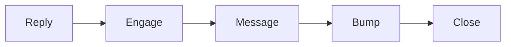
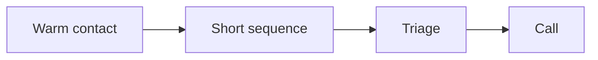

# Outreach playbook

This playbook turns warm contacts into appointments with a simple message
sequence.

## Goal

Book calls with people who already know you. Good looks like a short, friendly
sequence that leads to a call. Use it with people who joined the group or opted
in. Do not message strangers.

## When to use

Use this playbook on the run line, after the group and the funnel work. It is
the organic path to appointments.

## Roles

- Setter: sends the messages and books calls.
- Delivery lead: owns the sequence and the target.
- Coach: checks the tone and the fit.
- Client: approves the messages.

## Inputs

- The group and the lead list.
- The one currency and message.
- The calendar and the booking page.

## Named framework

- **The two-step path.** A group plus a nurture plus a message sequence can
  raise appointments far above cold outreach.
- **The seven touches.** A friendly sequence: reply, tag, connect, engage, a
  first message, a soft bump, and a polite close.
- **The triage call.** A short first call to check fit, then book the main call.

## Steps

1. Start with people who joined the group or opted in.
2. Reply to a comment or post first.
3. Connect and engage for a day or two.
4. Send the first short, helpful message.
5. Send a soft bump if there is no reply.
6. Send one polite close. Then stop.
7. Book a short triage call when they show interest.
8. On the triage call, check fit and book the main call.
9. Keep a simple pipeline: new, warm, booked, and closed.
10. Keep a healthy pace. Do not flood one person with messages.

Here is the seven-touch path.

## Keep it warm

Outreach works when the person already knows you. Start from the group, the
list, or a reply.

## Gate

Every message goes to a warm contact. The sequence stops after the polite
close. No reply means no more messages.

## Metrics

- Reply rate.
- Appointments booked per hundred contacts.
- Triage to main call rate.

## Outputs

- A message sequence.
- A simple pipeline.
- Booked calls.

## Common failures

- Messaging strangers. Fix: start from the group or the list.
- Sending too many messages. Fix: stop after the polite close.
- No triage. Fix: check fit before the main call.
- A pushy tone. Fix: keep every message short and helpful.

## Related

- Checklist: [Two-step outreach](../checklists/two-step-outreach.md)
- Playbook: [Super group playbook](super-group.md)
- Playbook: [Enroll playbook](enroll.md)
- SOP: [Outreach sequence](../sops/outreach-sequence.md)
