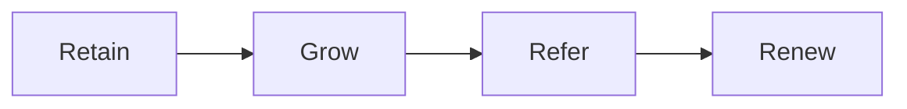

# Partnership playbook

This playbook keeps clients for years as their results and assets grow.

## Goal

Keep every client for the long term. Hold regular check-ins. Watch for quiet or
stuck clients. Offer the next step. Build a community. Ask for referrals. Renew
and expand.

## When to use

Use this playbook in the Grow and Partner stages, after delivery. It runs for
the life of the client.

## Roles

- Partnership lead: owns the relationship and the renewal.
- Community manager: runs the client community.
- Delivery lead: shares client results.
- Client: stays engaged and grows.

## Inputs

- A delivered client with results.
- The client scorecard and the case study.
- The next-offer path.
- The community rules.

## Steps

1. Hold regular check-ins.
2. Watch for clients who are quiet or stuck.
3. Reach out to quiet clients with a simple offer of help.
4. Offer the next step at the right time.
5. Build a community of clients.
6. Ask happy clients for referrals.
7. Renew and expand the work.
8. Track reviews, stories, and press.

## Gate

Every client has a next step and a reason to stay.

## Metrics

- Renewal rate.
- Revenue per client.
- Referrals.
- Community activity.
- Reviews and stories.

## Outputs

- Longer client life.
- More revenue per client.
- Advocates.

## Common failures

- Going quiet after delivery. Fix: keep a check-in rhythm.
- No next step. Fix: build the next-offer path.
- Asking for referrals too early. Fix: ask after a win.
- No community. Fix: start small and set simple rules.

## Related

- Checklist: [Renewal and win-back](../checklists/renewal-winback.md)
- Checklist: [Referral and partner](../checklists/referral-partner.md)
- Checklist: [Community rules](../checklists/community-rules.md)
- Checklist: [Reputation track](../checklists/reputation-track.md)
- SOP: [Renewal](../sops/renewal.md)
- SOP: [Referral](../sops/referral.md)
- SOP: [Community moderation](../sops/community-moderation.md)
- SOP: [Reputation](../sops/reputation.md)
- SOP: [Quarterly review](../sops/quarterly-review.md)

The partnership loop has four moves.

