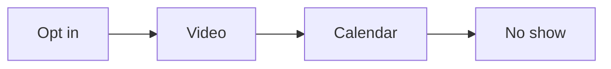
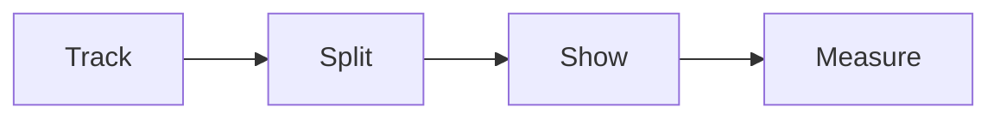

# Retargeting playbook

This playbook brings back the people who got stuck in the funnel.

## Goal

Show the right ad to the right group. Bring back people who visited but did not
act. Follow the steps in order. One audience per funnel step.

## When to use

Use this playbook at Station 7, after traffic is live. Use it on the run line
for every funnel step.

## Roles

- Delivery lead: owns the plan and the budget.
- Ads specialist: builds the audiences and the ads.
- Coach: checks the tracking and the goals.
- Client: approves the plan.

## Inputs

- A live ad campaign.
- Tracking and goals set up.
- The funnel pages and the authority video.
- The one currency and message.

## Named framework

- **These people, not these people.** For every ad, name who should see it and
  who should not. Exclude the buyers.
- **One audience per step.** Split people by where they stopped: opt in, video,
  calendar, or no show.
- **The 5P ad creative.** Use the same five message types in the ads: Problem,
  Promise, Proof, Ping, and Promotion.

## Steps

1. Add tracking and goals to every funnel step.
2. Split audiences by where each person stopped.
3. Pick the right group for each ad.
4. Exclude people who already bought.
5. Write one focused ad for each group.
6. Use the 5P types for the ad copy.
7. Show the ad to small groups at low cost.
8. Measure the result and repeat.

Here is how each stop gets its own ad.

## Gate

Follow the steps in order. Target the right people. Exclude the right people.
Ignore the rest.

## Metrics

- Return on ad spend lift.
- Cost per lead by audience.
- Recovery rate.
- Frequency and reach.

## Outputs

- A retargeting plan.
- A set of ads.
- A live retargeting campaign.

## Common failures

- Showing the same ad to everyone. Fix: split by where they stopped.
- Forgetting to exclude buyers. Fix: add the buyer list.
- Changing many things at once. Fix: change one variable at a time.
- No tracking. Fix: set up tracking first.

## Related

- Playbook: [Traffic playbook](traffic.md)
- Playbook: [Content playbook](content.md)
- Playbook: [Funnel playbook](funnel.md)
- Playbook: [Webinar playbook](webinar.md)
- SOP: [Retargeting setup](../sops/retargeting-setup.md)

Retargeting follows the same path at each step.

