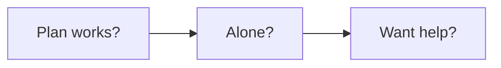
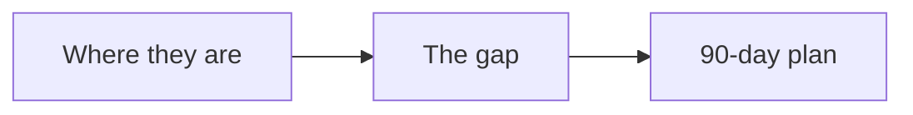

# Strategy session playbook

This playbook turns a paid roadmap session into a client, with no pressure.

## Goal

Run a paid session that maps the lead's next 90 days. Good looks like a clear
plan the lead believes in. The fee filters out people who are not ready, and it
earns revenue before the program.

## When to use

Use this playbook for premium offers, usually $10,000 or more. Use it when a
free call would attract people who are not ready.

## Roles

- Enrollment specialist: runs the session.
- Delivery lead: owns the offer and the price.
- Coach: reviews recorded sessions.
- Client: approves the roadmap.

## Inputs

- The signature solution and the roadmap.
- The one currency and message.
- The application and the booking page.

## Key ideas

- **The paid roadmap session.** The lead pays a fee, often $1,000 with a $500
  floor. In return they get a plan.
- **The before and after map.** Walk the lead through each step of the roadmap.
  Mark what they have and what is missing.
- **The three questions.** The close uses three calm questions, not a pitch.
- **The fee credit.** Apply the session fee to the first month of the program.

## Steps

1. Set the session price. Usually $1,000. The floor is $500.
2. Gate the session with a short application.
3. Before the session, review the lead against the roadmap.
4. Run the session. Audit each step. Ask for exact numbers.
5. Build the 90-day plan with the lead.
6. Ask the three questions.
7. Invite them to the program. Apply the fee to month one.
8. If it is a no, end well and keep the plan.

Here are the three questions.

- Are you 100% confident this plan can work?
- Could you do this alone?
- Do you want my help to do it faster?

## The before and after map

The plan shows the gap. The lead sees what is missing. That gap is the reason to
join.

## Gate

The session runs on the roadmap. The three questions are asked in order. The
fee is credited if they join. The lead leaves with a plan either way.

## Metrics

- Session take rate.
- Session to program rate.
- Revenue from sessions.

## Outputs

- A paid roadmap session.
- A 90-day plan.
- A calm invitation.

## Common failures

- Selling on the session. Fix: build the plan and ask the three questions.
- No application. Fix: gate the session.
- No credit offer. Fix: apply the fee to month one.
- A free session. Fix: charge a fee to filter.

## Related

- Checklist: [Strategy session call](../checklists/strategy-session-call.md)
- Playbook: [Enroll playbook](enroll.md)
- Playbook: [Enrollment service playbook](enrollment-service.md)
- SOP: [Strategy session run](../sops/strategy-session-run.md)
