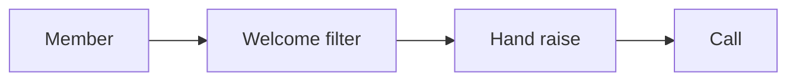
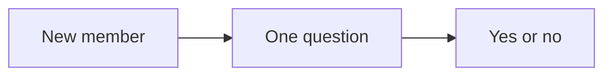

# Super group playbook

This playbook runs a controlled group that warms leads and creates appointments
at little extra cost.

## Goal

Run a group where leads learn from you and raise their hand. Good looks like a
group with a clear welcome, a simple filter, and steady posts that lead to a
call. The group sits between the lead magnet and the call.

## When to use

Use this playbook in the Content and Retargeting stations. Add it after the
funnel works. It runs on the run line.

## Roles

- Community manager: runs the group and the welcome.
- Delivery lead: owns the plan and the calendar.
- Coach: checks the offer fit.
- Client: posts and replies as the expert.

## Inputs

- The signature solution and the roadmap.
- The one currency and message.
- The lead magnet and the authority video.

## Key ideas

- **The welcome filter.** A new member posts one simple question: "Do you want
  to learn more?" People who say yes raise their hand.
- **The two-step post.** Give value in one line, then invite a reply in the
  next. Two steps, not one.
- **One piece, six channels.** One asset is posted in the group and reused
  across the other channels.

## Steps

1. Set up the group. Write a clear description with one action.
2. Write the welcome post. Ask one filter question.
3. Tag the members who raise their hand.
4. Plan a simple post calendar.
5. Post two-step posts, lives, case studies, and useful prompts.
6. Keep every post inside the signature solution.
7. Reply to people who engage and invite a call.
8. Reuse each asset in the group and in the other channels.
9. Nurture the hand-raisers for about 90 days.
10. Track who is ready and who needs more time.

Here is the path from member to hand-raise to call.

## The welcome filter

The filter is simple and it works. A good group gets a high share of hand
raises. It still costs nothing to run.

## Gate

The group has a clear welcome and one filter. Every post lives inside the offer.
Hand-raisers get a follow-up within a day.

## Metrics

- Members and joins.
- Hand-raise rate.
- Calls booked from the group.
- Posts per week.

## Outputs

- A live group.
- A welcome filter.
- A post calendar.
- A set of hand-raisers.

## Common failures

- No welcome. Fix: add the filter question.
- Only promotion. Fix: use two-step posts, lives, and case studies.
- No replies. Fix: answer every hand-raise the same day.
- Content outside the offer. Fix: pull from the nine steps.

## Related

- Checklist: [Super group setup](../checklists/super-group-setup.md)
- Playbook: [Content playbook](content.md)
- Playbook: [Outreach playbook](outreach.md)
- Playbook: [Partnership playbook](partnership.md)
- SOP: [Community launch](../sops/community-launch.md)
