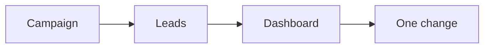
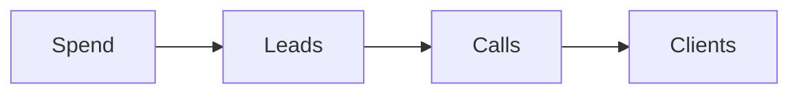

# Traffic playbook

This playbook turns on paid ads the right way.

## Goal

Turn on paid ads the right way. Good looks like a live ad campaign and a metrics
dashboard. Watch the few numbers that matter. Change one thing at a time.

## When to use

Use this after the funnel. It is Station 5.

## Roles

- Delivery lead: runs the campaign.
- Coach: checks the numbers.
- Client: approves the budget.

## Inputs

- A live funnel.
- Tracking and goals.
- A budget.

## Named framework

- **The metrics matrix.** A chain of numbers from stranger to customer. Each
  step has one number to watch.
- **One campaign, one ad set.** Keep the budget in one place. Many tiny ad sets
  fight each other and slow the machine down.
- **Bid to value.** Bid for the result you want, like a purchase or an
  appointment. Do not chase the cheapest lead.
- **The learning phase.** Leave a new campaign alone until it has about 25 to
  45 conversions. Then judge it.

## Steps

1. Set up tracking, audiences, and goals.
2. Work out the value of a lead. Use the funnel math.
3. Build a simple campaign: one campaign, one ad set, a few ads.
4. Launch the campaign.
5. Leave the new campaign alone for about 10 days.
6. Watch a few key numbers.
7. Change only one thing at a time.
8. Fix things up the funnel, one step at a time.
9. Test at the top of the funnel first.

Traffic feeds the funnel and the numbers.

## The numbers

Use these as targets, not promises.

- Cost per lead: about $10 to start.
- Leads that book a call: 3 to 5%.
- Calls that enroll: 20 to 40%.
- Plan for about 1 lead in 100 to buy.

The chain runs like this.

## Fix a weak campaign

Work down the chain. Do not blame the ad first.

1. Too few customers? Check the call, then the offer.
2. Too few calls? Check the funnel pages.
3. Too few leads? Check the ad and the audience.
4. Good leads, no sales? Check follow-up.

## Gate

Enough leads per day to learn. Do not touch a new campaign too early. Only fix
things up the funnel, one step at a time.

## Metrics

- Cost per lead.
- Cost per booked call.
- Return on ad spend.
- Learning phase status.

## Outputs

- A live ad campaign.
- A metrics dashboard.

## Common failures

- The campaign is changed too early. Fix: wait about 10 days.
- Many things change at once. Fix: change one variable at a time.
- The funnel is blamed first. Fix: check the funnel before the ads.
- Chasing cheap leads. Fix: raise the lifetime value.

## Related

- Checklist: [Ad fix](../checklists/ad-fix.md)
- Checklist: [Funnel math](../checklists/funnel-math.md)
- Playbook: [Numbers playbook](numbers.md)
- Playbook: [Retargeting playbook](retargeting.md)
- SOP: [Ad campaign setup](../sops/ad-campaign-setup.md)
