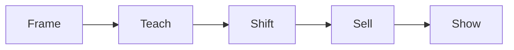
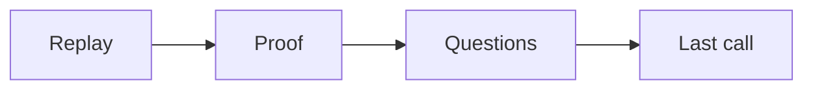

# Webinar playbook

This playbook runs a webinar that teaches and sells at scale. It is the scaled
path of enrollment.

## Goal

Run one webinar that teaches real value and makes one clear offer. Good looks
like a webinar that follows a fixed shape and a fixed clock. It turns many
leads into calls at once.

## When to use

Use this playbook after the simple path works. The simple path is a lead magnet
to a call. Build the simple path first, then add the webinar.

## Roles

- Delivery lead: owns the run of show.
- Coach: checks the teach and the offer.
- Producer: builds the slides and the pages.
- Client: presents the webinar.

## Inputs

- The signature solution.
- The one currency and message.
- The live funnel and the email list.

## Key ideas

- **The six phases.** Frame, teach three times, shift, sell, and show. About
  60 minutes in total.
- **Teach the what, not the how.** Teach the idea and the path. Keep the deep
  how to do inside the offer.
- **The three teach blocks.** The three blocks match the three phases of the
  signature solution.
- **The 10-and-10 rule.** Run ten live webinars at 10% or better before you
  automate.

## Steps

1. Plan the webinar. Pick the title, the offer, and the price.
2. Build the slides from the Content Crusher.
3. Write the frame: promise, who it is for, and who it is not for.
4. Write three teach blocks. One per phase of the signature solution.
5. Write the shift: two options and a request to show the program.
6. Write the sell: a tour, a value stack, the price, and a guarantee.
7. Write the show: welcome new clients and answer doubts as questions.
8. Build the pages: sign up, train, webinar, replay, and order.
9. Send the email sequence. Use the 5P types.
10. Run the webinar live.
11. Send the replay to everyone, including people who missed it.
12. Run the closing sequence for 3 to 5 days.
13. Retarget each group by where they stopped.
14. Automate only after ten live runs at 10% or better.

Here is the clock for a 60-minute webinar.

## The closing sequence

The closing sequence drives most of the sales. It runs for 3 to 5 days and can
bring 50 to 75% of the revenue.

## Target numbers

Use these as targets, not promises. They are examples from the canon.

- Register: about 40%.
- Show up: about 40%.
- Buy live: about 8%.
- Buy from the replay: 3 to 5%.

## Gate

The webinar follows the six phases. It teaches the signature solution. It makes
one offer. The replay goes to everyone. The closing sequence runs 3 to 5 days.

## Metrics

- Sign-up rate.
- Show rate.
- Live and replay conversion.
- Revenue from the closing sequence.

## Outputs

- A webinar run of show.
- A slide deck.
- A page set.
- An email sequence.
- A closing sequence.

## Common failures

- A cold webinar. Fix: advertise a lead magnet first, not the webinar.
- Teaching too much how. Fix: teach the what, keep the how for the offer.
- Bragging that an automated webinar is live. Fix: never fake it.
- No closing sequence. Fix: run it for 3 to 5 days.

## Related

- Checklist: [Webinar run of show](../checklists/webinar-run-of-show.md)
- Checklist: [Email sequence](../checklists/email-sequence.md)
- Playbook: [Email and nurture playbook](email-nurture.md)
- Playbook: [Enroll playbook](enroll.md)
- Playbook: [Retargeting playbook](retargeting.md)
- SOP: [Webinar build](../sops/webinar-build.md)
- Method: [The enrollment evolution](../../method/enrollment-evolution.md)
