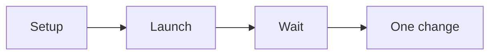

# Ad campaign setup SOP

This procedure sets up and launches one simple ad campaign.

## Trigger

The funnel is live. The ads specialist starts this procedure in the Traffic
station.

## Roles

- Ads specialist: builds and runs the campaign.
- Delivery lead: owns the budget.
- Coach: checks the numbers.
- Client: approves the budget.

## Procedure

1. Set up tracking, audiences, and goals.
2. Work out the value of a lead with the funnel math.
3. Build one campaign.
4. Build one ad set with a few ads.
5. Bid for the result you want, like a purchase or a booking.
6. Write the ad copy with the one message.
7. Test two hooks against the same body.
8. Launch the campaign.
9. Leave it alone for about 10 days.
10. Wait for about 25 to 45 conversions.
11. Check the few key numbers.
12. Change one thing at a time.

Keep one campaign and one ad set.

## Decision points

- If leads are cheap but do not book, check the funnel.
- If the learning phase is not done, do not judge the ad.
- If two hooks run at once, kill the weaker one.
- If you want to model a proven funnel, map it first and do not copy it.

## Escalation

Tell the delivery lead when the budget is spent early. Tell the coach when a
number is far from the target.

## Records

Save the campaign settings, the ad copy, and the numbers in the client folder.
