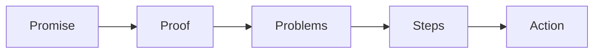

# Authority video build SOP

This procedure builds the authority video from the six blocks.

## Trigger

The offer is approved. The producer starts this procedure in the Funnel station.

## Roles

- Producer: records and edits.
- Delivery lead: writes the script.
- Coach: checks the script against the offer.
- Client: records the video.

## Procedure

1. Gather the one currency, the message, and the roadmap.
2. Write the promise block.
3. Write the proof block. Lead with the best result.
4. Write the problems block. Name three obstacles.
5. Write the steps block. Show three phases and nine steps.
6. Write the context block. Say who you are and why you.
7. Write the action block. One clear next step.
8. Check the script is right before the slides.
9. Build the slides from the script.
10. Record the video.
11. Edit the video and add captions.
12. Cut the same script into nine short step videos.
13. Post the videos on the page.

The six blocks run every asset.

## Decision points

- If the script is long, cut the context block first.
- If the proof is thin, use a customer result or a borrowed result.
- If the slides are made before the script, stop and fix the script.
- If the video is over 20 minutes, trim it.

## Escalation

Tell the coach when there is no proof. Tell the delivery lead when the offer
and the video do not match.

## Records

Save the script, the slides, and the final video in the client folder. Keep the
step videos together.
