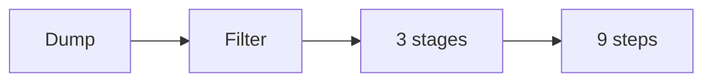

# Brain dump to roadmap SOP

This procedure turns a raw brain dump into a product roadmap.

## Trigger

The one currency and message are approved. The delivery lead starts this
procedure in the Offer station.

## Roles

- Delivery lead: runs the dump and shapes the roadmap.
- Coach: checks the weakest-link test.
- Client: dumps the ideas and approves the roadmap.

## Procedure

1. Dump every step, topic, and question the buyer faces between point A and
   point B.
2. Pull more ideas from books, courses, reviews, and search.
3. Group the ideas into themes.
4. Remove anything that is not essential.
5. Run the weakest-link test. If a step is removed, does the outcome break?
6. Force the rest into three stages.
7. Break each stage into three steps.
8. Break each step into three actions.
9. Give every step one clear action.
10. Give every step one deliverable.
11. Name the roadmap for the person and the result.
12. Get feedback before design.

The dump becomes a roadmap of three by three by three.

## Decision points

- If a step is not essential, cut it.
- If there are more than three stages, merge them.
- If a step has no deliverable, design one.
- If the client wants to skip the dump, say no. The dump finds the product.

## Escalation

Tell the coach when the roadmap will not fit the rule of threes. Tell the
delivery lead when the buyer or the currency is unclear.

## Records

Save the dump, the filtered list, and the final roadmap in the client folder.
Keep the deliverables list with them.
