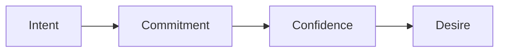

# Call audit SOP

This procedure reviews a recorded enrollment call and finds the weak gate.

## Trigger

A call is recorded. The coach starts this procedure every week.

## Roles

- Coach: reviews the call.
- Enrollment specialist: runs the call.
- Delivery lead: owns the fix.

## Procedure

1. Listen to the recorded call.
2. Note where the call ended: which gate.
3. Check the intent gate.
4. Check the commitment gate.
5. Check the clarity gate.
6. Check the confidence gate.
7. Check the desire gate.
8. Note one thing that worked.
9. Note one thing to fix.
10. Fix the script or the practice.
11. Track the end points across calls.

Each call ends at one gate.

## Decision points

- If most calls end at one gate, fix the script for that gate.
- If the specialist talks too much, practice listening.
- If a price is quoted early, fix the sequence.
- If a call ends at a no, treat it as a success.

## Escalation

Tell the delivery lead when a gate fails across most calls. Tell the coach when
the specialist needs more practice.

## Records

Save the call notes, the end point, and the fixes in the client folder.
