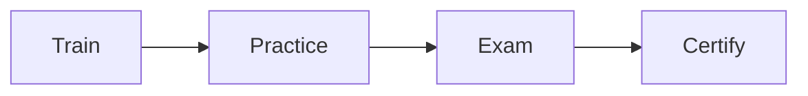

# Certification exam SOP

This procedure trains and certifies an operator.

## Trigger

A team is ready to run the system. The delivery lead starts this procedure in
the Serve stage.

## Roles

- Delivery lead: owns the standard and the exam.
- Coach: trains the operator.
- Operator: learns and takes the exam.
- Client: names the team.

## Procedure

1. Write the short list of skills an operator must hold.
2. Train the operator on the [playbooks](../index.md) and the [roadmap](../checklists/product-roadmap.md).
3. Have the operator run real work with a coach watching.
4. Set the exam and a clear pass mark.
5. Test the operator against the standard.
6. Certify the ones who pass.
7. Keep a register of certified people.
8. Recheck the standard every year.

The path runs from training to a certified operator.

## Decision points

- If the operator has no real result, wait before certifying.
- If the exam is too easy, raise the pass mark.
- If a skill is missing, add training before the exam.
- If a standard is old, update it at the yearly recheck.

## Escalation

Tell the delivery lead when the team is not ready. Tell the coach when an
operator needs more practice.

## Records

Save the standard, the exam, the pass mark, and the register in the operations
folder.
