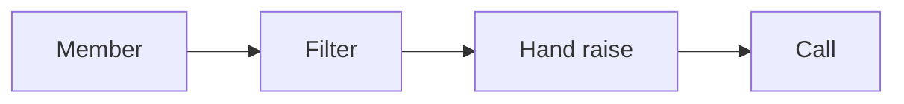

# Community launch SOP

This procedure opens and runs a controlled group.

## Trigger

The lead magnet and the funnel work. The community manager starts this
procedure in the Content station.

## Roles

- Community manager: runs the group and the welcome.
- Delivery lead: owns the plan and the calendar.
- Coach: checks the offer fit.
- Client: posts as the expert.

## Procedure

1. Name the group for the person and the result.
2. Write a clear description with one action.
3. Write the welcome post.
4. Add the filter question: "Do you want to learn more?"
5. Tag members who raise their hand.
6. Plan a simple post calendar.
7. Post two-step posts, lives, and case studies.
8. Keep every post inside the offer.
9. Reply to hand-raisers the same day.
10. Invite warm members to a call.
11. Nurture the rest for about 90 days.
12. Reuse each asset in the other channels.

The welcome filter finds the ready members.

## Decision points

- If the group is dead, add lives and two-step posts.
- If a hand-raise waits, answer it the same day.
- If a post leaves the offer, cut it.
- If the group is small, keep it simple and focus on warmth.

## Escalation

Tell the delivery lead when the group is not attracting the right people. Tell
the coach when posts drift from the offer.

## Records

Save the description, the welcome post, the calendar, and the hand-raise list
in the client folder.
