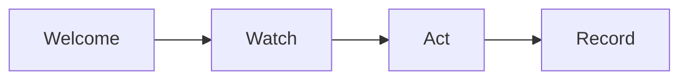

# Community Moderation SOP

This procedure keeps the client community safe and kind.

## Trigger
A new member joins. Or a post breaks a rule. Or a member reports a problem.

## Roles
The community manager runs this procedure. The coach answers method questions. The partnership lead handles member issues.

## Procedure
1. Welcome each new member. Share the rules and the start guide.
2. Watch the feed each day. Read new posts and replies.
3. Act on rule breaks. Warn first, then remove.
4. Record each action. Note the member, the post, and the reason.
5. Report the week. Share what you saw and what you did.
6. Thank good members. Point out helpful posts.

Here is the moderation path.

## Decision points
- If a post is spam, remove it and warn the member.
- If a post is rude, hide it and talk to the member.
- If a member repeats a break, pause their access.
- If a post is a threat, remove it and tell the owner at once.

## Escalation
Tell the partnership lead about member issues. Tell the owner about threats, legal risk, or press risk.

## Records
Save the rules, the action log, and the weekly report. Keep them in the community folder.
