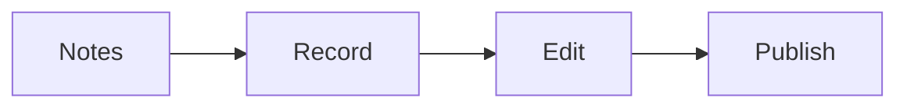

# Course production SOP

This procedure records, edits, and publishes the modules fast.

## Trigger

The slide decks are approved. The producer starts this procedure in the
Delivery station.

## Roles

- Producer: records and edits.
- Client: records the lessons.
- Delivery lead: owns the plan and the dates.
- Coach: checks each module.

## Procedure

1. Build a production plan with the days and the modules.
2. Set up the camera, mic, and light.
3. Write short speaker notes for each slide.
4. Record one slide per take.
5. Clap or snap at the start of each take.
6. Record in wide screen at high quality.
7. Keep each lesson between 5 and 30 minutes.
8. Cut at the clap or snap marks.
9. Smooth the sound and remove noise.
10. Add captions.
11. Publish each module to the course site.
12. Add the deliverable for each step.

One slide per take keeps editing quick.

## Decision points

- If a lesson runs long, split it into two.
- If the sound is bad, re-record the take.
- If a module has no deliverable, add one before publishing.
- If a live cohort is running, record live and reuse it.

## Escalation

Tell the delivery lead when the date is at risk. Tell the coach when a module
does not match the roadmap.

## Records

Save the plan, the raw takes, the final videos, and the captions in the client
folder.
