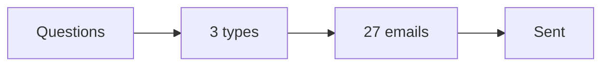

# Email sequence build SOP

This procedure builds one nurture sequence for one funnel step.

## Trigger

The roadmap and the content plan are ready. The producer starts this procedure
in the Content station.

## Roles

- Producer: writes the emails.
- Delivery lead: owns the plan.
- Coach: checks the offer fit.
- Client: approves the emails.

## Procedure

1. Pick the funnel step and the goal.
2. List the buyer's common questions for that step.
3. Write a value email.
4. Write a problem email.
5. Write an offer email.
6. Use the 5P types: Problem, Promise, Proof, Ping, Promotion.
7. Add one clear action to every email.
8. Keep promotion to about one in five.
9. Build the full 27-part sequence.
10. Reuse the slides as emails.
11. Schedule the sends.
12. Send until the lead acts.

The sequence gives value and makes one clear offer.

## Decision points

- If an email has no action, add one.
- If promotion is over the cap, add more value emails.
- If a lead acts, stop the sequence for that step.
- If opens are low, rewrite the subject line.

## Escalation

Tell the delivery lead when the offer is unclear. Tell the coach when an email
leaves the offer.

## Records

Save the sequence, the schedule, and the open and click rates in the client
folder.
