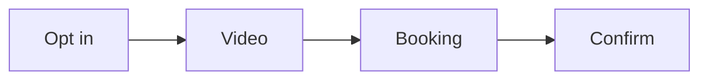

# Funnel build SOP

This procedure builds the short funnel from opt in to booked call.

## Trigger

The offer and the message are approved. The delivery lead starts this procedure
in the Funnel station.

## Roles

- Delivery lead: runs the build.
- Producer: builds the pages and the video.
- Coach: checks the script and the pages.
- Client: records the video.

## Procedure

1. Gather the signature solution, the message, and the brand assets.
2. Write the authority video script with the six blocks.
3. Check the script before the slides.
4. Build the opt-in page.
5. Add the two-step opt in.
6. Build the video page.
7. Build the booking page with the calendar.
8. Add the 72-hour booking window.
9. Build the confirmation page.
10. Add a pre-call homework page.
11. Add three or four confirmations.
12. Test each page on a phone.
13. Turn the funnel on.

The funnel runs from opt in to booked call.

## Decision points

- If the script is weak, stop before slides.
- If opt-in is low, test the title and the image.
- If show rate is low, tighten the 72-hour window and confirmations.
- If the funnel leaks, check each page in order.

## Escalation

Tell the coach when the offer and the funnel do not match. Tell the delivery
lead when the calendar tool is not ready.

## Records

Save the script, the page copy, the video, and the test results in the client
folder.
