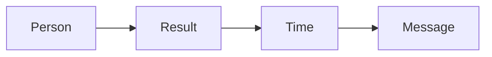

# Million dollar message SOP

This procedure writes the one message from the one currency.

## Trigger

The currency calculator is done. The delivery lead starts this procedure in the
Message station.

## Roles

- Delivery lead: writes the message.
- Coach: runs the filters.
- Client: approves the message.

## Procedure

1. Take the approved one currency.
2. Add the metric.
3. Add the timeline.
4. Name the three main frictions.
5. Write the message: "I help [person] get [result] in [time] without
   [friction]."
6. Run the 3 a.m. test. Does it wake the buyer up?
7. Check it is a painkiller, not a vitamin.
8. Check it is in the buyer's own words.
9. Read it out loud. Cut any hype.
10. Repeat three or four times until it lands.
11. Get the message approved.
12. Save it as the master. Use pieces of it everywhere.

The message ties the person, the result, and the time.

## Decision points

- If it has no metric, add a number.
- If it has no timeline, use the length of the program.
- If the buyers do not react, ask them which problem to solve first.
- If it does not fit one line, it is not ready.

## Escalation

Tell the coach if the currency keeps changing. Tell the delivery lead if the
client wants to keep more than one message.

## Records

Save the currency, the message, and the filter notes in the client folder.
Keep the approved version at the top.
