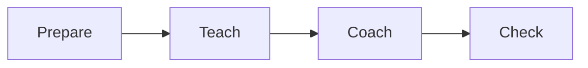

# Module delivery SOP

This procedure delivers one module of the program. It covers prepare, teach,
coach, check, and record.

## Trigger

The client starts a new module week. The coach runs this procedure once for
each module.

## Roles

- Coach: prepares the module, teaches it, and coaches the client.
- Delivery lead: checks the module fits the plan and the goals.
- Client: does the work and brings questions to the call.

## Procedure

1. Prepare the module. Read the module goal. Check it fits the one-page plan.
2. Prepare the materials. Get the slides, the worksheet, and the example ready.
3. Send the pre-work. Tell the client what to do before the teach call.
4. Teach the module. Explain the idea in plain words. Show one example.
5. Coach the client. Help them apply the idea to their own work.
6. Check the work. Look at what the client made. Give clear feedback.
7. Check the gate. Confirm the client passed the module gate before moving on.
8. Record the result. Note what the client did and what comes next.
9. Send the recap. Give the client the next step and the next call date.

Teach on one day. Coach on another day. Keep the two calls separate.

## Decision points

- If the client did not do the pre-work, coach on the gap first. Do not teach
  the next idea.
- If the client fails the gate, repeat the module. Do not move on.
- If the module does not fit the plan, tell the delivery lead before you teach.
- If the client is stuck, slow down. Use a smaller step.

## Escalation

Tell the delivery lead when a client fails a gate twice or misses two calls in
a row. If the client is at risk, tell the operations owner.

## Records

Save the module notes, the client work, the gate result, and the recap in the
client folder. Keep the attendance list with the module notes.
