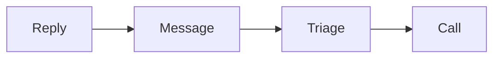

# Outreach sequence SOP

This procedure books calls with warm contacts.

## Trigger

The group and the funnel work. The setter starts this procedure on the run line.

## Roles

- Setter: sends the messages and books calls.
- Delivery lead: owns the sequence and the target.
- Coach: checks tone and fit.
- Client: approves the messages.

## Procedure

1. Start with warm contacts only.
2. Reply to a post or comment first.
3. Engage for a day or two.
4. Send the first short, helpful message.
5. Send a soft bump if there is no reply.
6. Send one polite close.
7. Stop after the polite close.
8. Book a short triage call on interest.
9. Check fit on the triage call.
10. Book the main call for fits.
11. Keep a simple pipeline: new, warm, booked, closed.

A short, warm sequence leads to a triage call.

## Decision points

- If the contact is cold, do not message. Wait for warmth.
- If there is no reply after the polite close, stop.
- If a fit is poor, end the triage kindly.
- If someone asks to stop, remove them at once.

## Escalation

Tell the delivery lead when the reply rate is low. Tell the coach when the tone
feels pushy.

## Records

Save the sequence, the pipeline, and the reply rates in the client folder.
