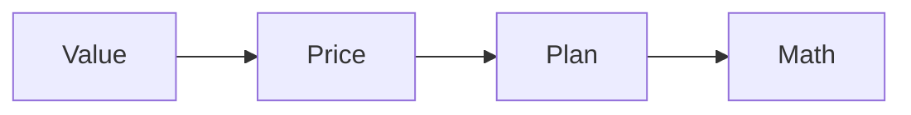

# Pricing review SOP

This procedure reviews and updates the price of an offer.

## Trigger

The offer has run for about 90 days. The delivery lead starts this procedure.

## Roles

- Delivery lead: owns the price.
- Coach: checks the value.
- Client: approves the change.

## Procedure

1. Pull the funnel numbers.
2. Work out the value of one client.
3. Check the cost per client against the value.
4. Review the close rate on calls.
5. Look for ways to raise value: more deliverables or a bundle.
6. Raise the price if value is proven.
7. Add or update a payment plan.
8. Keep the no-discount rule.
9. Update the guarantee or the no-guarantee rule.
10. Update the funnel math.

Price follows value.

## Decision points

- If close rate is high, the price may be too low.
- If sales are strong, raise the price. Expect a small drop.
- If a lead asks for a discount, shorten the path instead.
- If value has not changed, keep the price.

## Escalation

Tell the coach when the value is unclear. Tell the delivery lead when the
numbers do not support a change.

## Records

Save the old price, the new price, the plan, and the math in the client folder.
