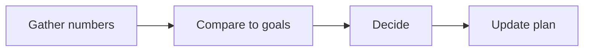

# Quarterly Review SOP

This procedure reviews the plan every 90 days.

## Trigger
The quarter ends. Or 90 days pass since the last review.

## Roles
The delivery lead runs this procedure. The coach gives progress notes. The partnership lead gives renewal and referral numbers.

## Procedure
1. Gather the numbers. Pull revenue, clients, cost per lead, and cost per client.
2. Compare the numbers to the goals in the plan.
3. Note what worked and what did not.
4. Decide what to keep, stop, or change.
5. Update the one-page plan. Set new goals for the next 90 days.
6. Share the plan with the team.
7. Set the date for the next review.

Here is the review loop.

## Decision points
- If a goal is met, raise it or keep it.
- If a goal is missed, find the cause first.
- If a channel works, put more into it.
- If a channel fails, pause it and test one change.

## Escalation
Tell the owner when the plan needs a big change. Tell the delivery lead when a goal is at risk.

## Records
Save the numbers, the old plan, and the new plan. Keep them in the plan folder.
