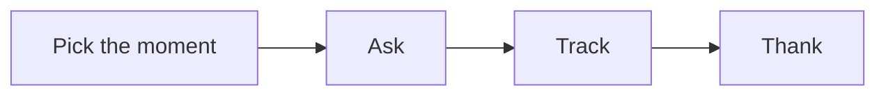

# Referral SOP

This procedure turns a happy client into a new client.

## Trigger
A client hits a result. Or a client says something good about the work.

## Roles
The partnership lead runs this procedure. The delivery lead flags the moment. The coach shares praise from sessions.

## Procedure
1. Watch for the moment. A result, a win, or a kind word.
2. Ask the client for a referral. Be direct and calm.
3. Make it easy. Give a short note the client can forward.
4. Name the kind of person you want to meet.
5. Track each ask and each name in one list.
6. Follow up on each name within two days.
7. Thank the client. Send a note or a small gift.
8. Tell the client what happened with the referral.

Here is the referral loop.

## Decision points
- If the client is happy, ask right away.
- If the client is busy, ask at the next check-in.
- If the client is not happy, fix the work first.
- If a referral does not fit, say so and keep the relationship.

## Escalation
Tell the partnership lead when a referral is a large one. Tell the owner when a partner wants a formal deal.

## Records
Save each ask, each name, and each thank-you. Keep them in the referral tracker.
