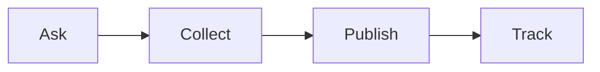

# Reputation SOP

This procedure grows reviews, stories, and press for RED.

## Trigger
A client hits a result. Or a review window opens. Or a press chance appears.

## Roles
The partnership lead runs this procedure. The delivery lead flags results. The community manager shares member stories.

## Procedure
1. Ask happy clients for a review. Send a direct link.
2. Collect the review. Save it in one place.
3. Ask for a short story. Use the case study checklist.
4. Publish the review and the story. Use the site and social channels.
5. Track each review and each mention. Note the date and the source.
6. Reach out to press when a story is strong.
7. Thank each person who gives a review or a story.

Here is the reputation path.

## Decision points
- If a review is bad, reply in private first. Fix the issue.
- If a story needs approval, get it before you publish.
- If press asks for a quote, keep it short and true.
- If a claim is not proven, do not publish it.

## Escalation
Tell the owner before you talk to press. Tell the partnership lead about any bad review.

## Records
Save each review, story, and press mention. Keep them in the reputation tracker.
