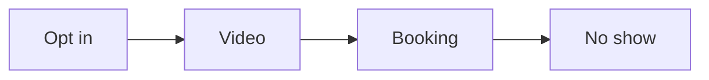

# Retargeting setup SOP

This procedure sets up retargeting for every funnel step.

## Trigger

The ad campaign is live. The ads specialist starts this procedure in the
Retargeting station.

## Roles

- Ads specialist: builds the audiences and the ads.
- Delivery lead: owns the plan and the budget.
- Coach: checks the tracking.
- Client: approves the plan.

## Procedure

1. Add tracking and goals to every funnel step.
2. Split audiences by where each person stopped.
3. Name the group to include.
4. Name the group to exclude, like buyers.
5. Write one focused ad for each group.
6. Use the 5P types for the ad copy.
7. Show the ad to small groups at low cost.
8. Measure the result and repeat.

Each stop gets its own ad.

## Decision points

- If the same ad goes to everyone, split the audiences.
- If buyers see the ad, add the buyer list to the exclude group.
- If the cost is high, shrink the audience and rewrite the ad.
- If tracking is missing, stop and fix it first.

## Escalation

Tell the delivery lead when tracking cannot be set. Tell the coach when the
numbers do not move.

## Records

Save the audience plan, the ad copy, and the results in the client folder.
