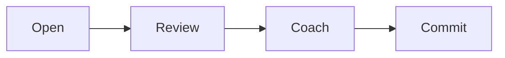

# Session coaching SOP

This procedure coaches a client on a call. It covers open, review, coach,
commit, and close.

## Trigger

A coaching call is on the calendar. The coach runs this procedure at the start
of the call.

## Roles

- Coach: runs the call and leads the coaching.
- Client: brings their work and their questions.
- Delivery lead: gets a note if the client needs a plan change.

## Procedure

1. Open the call. Set the time, the purpose, and the outcome.
2. Review the last step. Ask what the client did since the last call.
3. Review the numbers. Look at the client's progress against the goals.
4. Coach on one thing. Pick the one block that matters most. Work on it.
5. Ask questions. Let the client find the answer. Do not solve it for them.
6. Agree on the next step. Make it small and clear.
7. Get a commitment. Ask the client to say what they will do and by when.
8. Close the call. Recap the step. Confirm the next call date.
9. Send the note. Give the client the recap and the next step.

Coach on one thing per call. Do not try to fix everything at once.

## Decision points

- If the client has no work to review, coach on why. Do not move to a new topic.
- If the client is stuck on a block, pick a smaller step.
- If the client needs a plan change, tell the delivery lead after the call.
- If the client is upset, listen first. Then coach.

## Escalation

Tell the delivery lead when a client misses two calls or stops doing the work.
If the client wants to leave, tell the operations owner the same day.

## Records

Save the call note, the next step, and the commitment in the client folder.
Keep the call date and the attendance list with the note.
