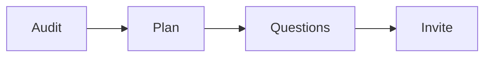

# Strategy session run SOP

This procedure runs one paid roadmap session.

## Trigger

A lead pays for a session. The enrollment specialist starts this procedure in
the Launch stage.

## Roles

- Enrollment specialist: runs the session.
- Delivery lead: owns the offer and the price.
- Coach: reviews recorded sessions.
- Client: approves the roadmap.

## Procedure

1. Confirm the session and the fee.
2. Gate the session with a short application.
3. Review the lead against the roadmap before the call.
4. Open the call: time, purpose, and outcome.
5. Audit each roadmap step. Ask for exact numbers.
6. Build the 90-day plan with the lead.
7. Ask the three questions.
8. Invite the lead to the program.
9. Apply the fee to month one.
10. If it is a no, end well and give the plan.

The plan is the pitch.

## Decision points

- If the lead is not a fit, end the session kindly.
- If confidence is low at the first question, go back to the plan.
- If it is a no, keep the plan and the goodwill.
- If the fee is not credited, fix the offer.

## Escalation

Tell the delivery lead when the session to program rate is low. Tell the coach
when the script feels pushy.

## Records

Save the application, the plan, and the outcome in the client folder.
