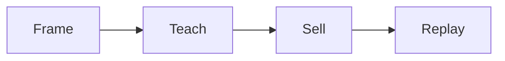

# Webinar build SOP

This procedure builds and runs a webinar.

## Trigger

The simple path works. The delivery lead starts this procedure in the Funnel
station.

## Roles

- Delivery lead: owns the run of show.
- Producer: builds the slides and the pages.
- Coach: checks the teach and the offer.
- Client: presents the webinar.

## Procedure

1. Plan the title, the offer, and the price.
2. Build the slides from the content crushers.
3. Write the frame block.
4. Write three teach blocks, one per phase.
5. Teach the what, not the how.
6. Write the shift block.
7. Write the sell block.
8. Write the show block.
9. Build the pages: sign up, train, webinar, replay, order.
10. Send the invite and reminder emails.
11. Run the webinar live.
12. Send the replay to everyone.
13. Run the closing sequence for 3 to 5 days.
14. Automate after ten live runs at 10% or better.

The webinar teaches and sells in about 60 minutes.

## Decision points

- If the webinar is cold, advertise a lead magnet first.
- If the teach is too deep, cut the how and keep the what.
- If the replay page has player controls, remove them.
- If conversion is under 10% live, fix the offer before automating.

## Escalation

Tell the coach when the offer is weak. Tell the delivery lead when the page set
is not ready.

## Records

Save the run of show, the slides, the pages, and the numbers in the client
folder.
