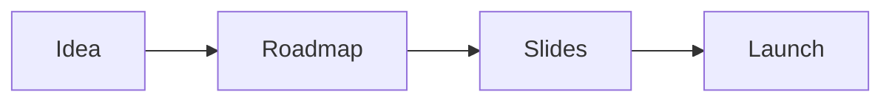

# 14-day course launch

This program compresses the build into 14 days. You go from a rough idea to a
live premium course.

## Who it helps

You want to finish. You have a topic and some knowledge. You need a short,
strict plan that gets you to launch.

## What you will learn

- Choose one currency and one clear customer.
- Turn your knowledge into a nine-step roadmap.
- Write the outline for every module.
- Fill a slide template you repeat each time.
- Record and publish fast.
- Price the course and open it to buyers.

Each day has one clear task.

## Start the program

[Open the 14-day course launch deck](14-day-course-launch.html){target="_blank"}

## Where to go next

- [Product roadmap](../method/product-roadmap.md): shape the three stages.
- [Course production SOP](../ops/sops/course-production.md): record and publish.
- [Pricing review SOP](../ops/sops/pricing-review.md): review the price.
